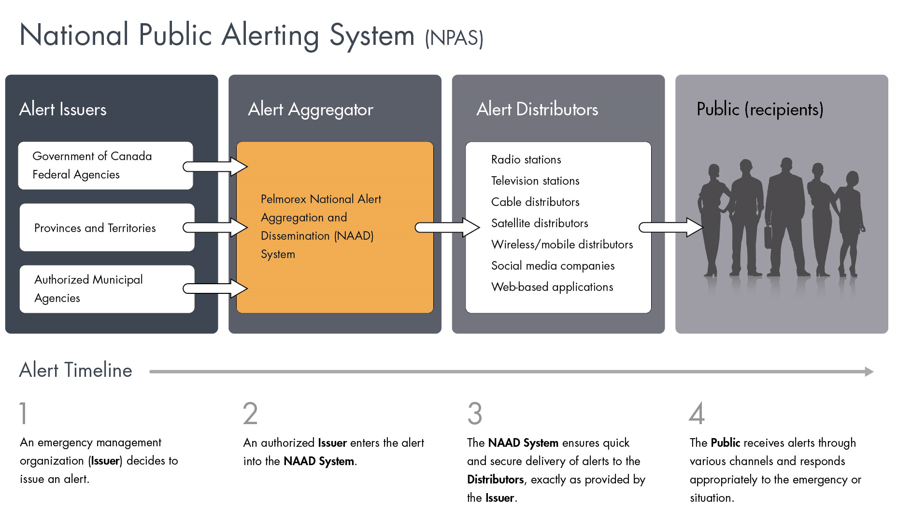
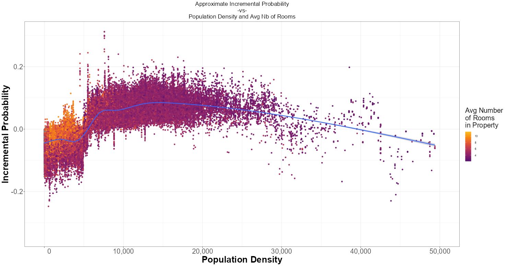
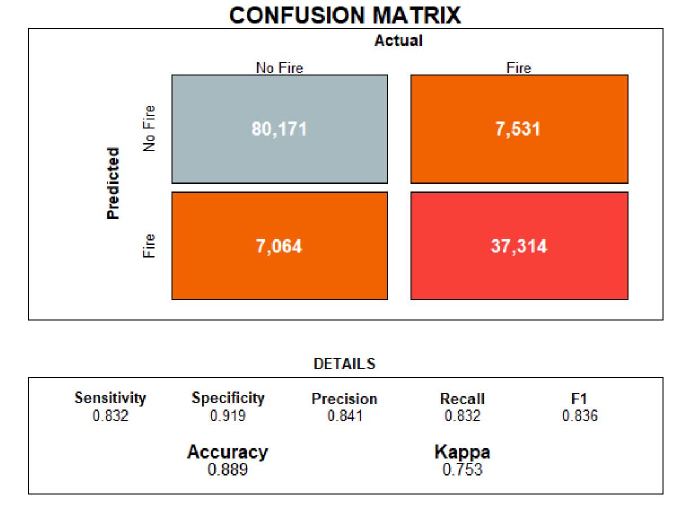

<script>
$("body").on("shown.bs.tab", "a[data-toggle='tab']", function(e) {

   //var delayInMilliseconds = 700; //0.7 second
    //setTimeout(function() {
          Shiny.setInputValue("active_tab", $(e.target).text());
          //Shiny.setInputValue("active_tab", $(e.target).parent().index());
  //  }, delayInMilliseconds); 
  

})

$('.navbar-header').wrap('<a href="#section-section" title="">');


$("body").on("shown.bs.tab", "a[data-toggle='dropdown']", function(e) {

   //var delayInMilliseconds = 700; //0.7 second
    //setTimeout(function() {
          Shiny.setInputValue("active_dropdown", $(e.target).parent().index());
  //  }, delayInMilliseconds);

})

</script>


```{css my-content-css, echo = FALSE}

/*==============================================================================*/
/* GLOBAL INTERFACE*/


.loaddots:after {
  content: ' .';
  animation: dots 1s steps(5, end) infinite;}

@keyframes dots {
  0%, 20% {
    color: rgba(0,0,0,0);
    text-shadow:
      .25em 0 0 rgba(0,0,0,0),
      .5em 0 0 rgba(0,0,0,0);}
  40% {
    color: #B97172;
    text-shadow:
      .25em 0 0 rgba(0,0,0,0),
      .5em 0 0 rgba(0,0,0,0);}
  60% {
    text-shadow:
      .25em 0 0 #B97172,
      .5em 0 0 rgba(0,0,0,0);}
  80%, 100% {
    text-shadow:
      .25em 0 0 #B97172,
      .5em 0 0 #B97172;}}


.tab-content {
  max-width: 100%;
  max-height: 100%;
  width: auto;
  height: 93%;
  display: inherit;
}


.tab-content>.active {
  max-width: 100%;
  max-height: 100%;
  width: auto;
  height: 93%;
}

 /* Hide horizontal scrollbar */
body {
  overflow-x: hidden;
}

.navbar .dropdown-menu .fa {
  text-align:center;
}

.dropdown-menu>li>a {
  color:#666666;
}

.fa {
  font-size:24px;
}

.fas a {
  color: #666666 !important;
}


.navbar-inverse .navbar-nav>.active>a, .navbar-inverse .navbar-nav>.active>a:hover, .navbar-inverse .navbar-nav>.active>a:focus {
  font-size: x-large;
}


/*==============================================================================*/
/* Introduction */

.introjs-skipbutton{
font-size:10px;
}

.bttn-stretch.bttn-primary{
  color: #6B6B6B;
  position: absolute;
  bottom: 5px;
  right: 5px;
  font-size: 20px;
}


/*==============================================================================*/
/* Story-board sections */

.panel{
  background-color:#E0E3E8;
}

.panel-info{
 border-color: darkgrey;
 border-width: thin;
}

/* to resize storyboard header panels*/
.storyboard-nav .sbframelist {
        margin: 0 auto;
        width: 94%;
        height: 110px;
        overflow: hidden;
        text-shadow: none;
        margin-bottom: 8px;
}

.storyboard-nav .sbnext, .storyboard-nav .sbprev {
        width: 2%;
        height: 100px;
        font-size: 50px;
}


/* to have a different backgroud color in the storyboard section*/
.sbframe-commentary {
  background: #f2fbff
}

/* So that a scroll bar appears in the story mode if screen not big enough */
.chart-shim {
  overflow-y: auto;
}


/* for lists sub-items, space between */
ul ul, ol ul {
  margin-bottom:10px;
}

/* For Units Buttons at the bottom left */
#myGroup > div {
  width: 45% !important;
  margin: 0px !important;
  border: none; 
  position:absolute;
  bottom: 5px;
  margin-top: 5px;
  margin-bottom: 0px;
}

.btn-myClass {
    background-color: #c6d0dc;
}
.btn-myClass.active{
    background-color: #A7B3C2;
}

/*==============================================================================*/
/* For Maps settings */
.leaflet-container, .leaflet-interactive {
  cursor: crosshair !important;
}


/*==============================================================================*/
/* For DataTable settings */
/* Hyperlink Color */
.dataTables_scrollBody a {
   color: #666666;
}

/*==============================================================================*/
/* Value-Box & Gauge parameters */
.html-widget.gauge text{
  fill: darkgrey !important;
}

.value-box a {
  color: #666666;
}

.value-box {
  color: #666666;
}

.value-box .icon i {
  font-size: 42px;
}

.value-box .value{
  font-size: 20px;
}


/*==============================================================================*/
/* IMAGES SETTINGS */

/* center and resize topex image */
.topex_image {
  display: block;
  margin-left: auto;
  margin-right: auto;
  width: 50%;
  height: auto;
  max-width:100%;
  max-height:100%;
}

.alerts_image {
  display: block;
  margin-left: auto;
  margin-right: auto;
  width: 90%;
  height: auto;
  max-width:100%;
  max-height:100%;
}

.maximized_container {
  width: 100%;
  height: 100%;
}

.maximized_image {
  display: block;
  margin-left: auto;
  margin-right: auto;
  max-width: 100%;
  max-height: 100%;
  width: auto;
  height: auto;
}


/*==============================================================================*/
/* Buttons settings */

.form-group {
  margin-bottom:-2px;
  margin-top:-2px;
}

.btn-xlarge {
    padding: 18px 28px;
    font-size: 22px; //change this to your desired size
    line-height: normal;
    -webkit-border-radius: 8px;
       -moz-border-radius: 8px;
            border-radius: 8px;
            
  box-shadow: 0px 3px 0px 0px #B7B7B7;
  letter-spacing: 0.07em;
  transition: all 0.4s ease;
}


.btn-xlarge:hover {
  transform: translateY(-6px);
  box-shadow: 0px 40px 29px -19px rgba(183, 183, 183, 0.9);
}


/*==============================================================================*/
/* Landing Page settings */

.centered-and-cropped { 
  object-fit: cover;
} 

.fit-head1 {
  padding: 10px;
  //background: rgba(247, 247, 247, .1);
  //backdrop-filter: blur(8px);
  //color: black !important;
  
  color: white !important;
  text-shadow: 1px 5px 1px rgba(0,0,0,.9);
  
  //#007E06;
  //#F3D1C8;
  //text-shadow: 0.0px 10.0px 0.02px #004001, 9.8px 2.1px 0.02px #004001, 4.2px -9.1px 0.02px #004001, -8.0px -6.0px 0.02px #004001, -7.6px 6.5px 0.02px #004001, 4.8px 8.8px 0.02px #004001, 9.6px -2.8px 0.02px #004001, -0.7px -10.0px 0.02px #004001, -9.9px -1.5px 0.02px #004001, -3.5px 9.4px 0.02px #004001, 8.4px 5.4px 0.02px #004001, 7.1px -7.0px 0.02px #004001, -5.4px -8.4px 0.02px #004001, -9.4px 3.5px 0.02px #004001, 1.4px 9.9px 0.02px #004001, 10.0px 0.8px 0.02px #004001, 2.9px -9.6px 0.02px #004001, -8.7px -4.8px 0.02px #004001, -6.6px 7.5px 0.02px #004001, 5.9px 8.0px 0.02px #004001, 9.1px -4.1px 0.02px #004001, -2.1px -9.8px 0.02px #004001, -10.0px -0.1px 0.02px #004001, -2.2px 9.8px 0.02px #004001, 9.1px 4.2px 0.02px #004001, 6.1px -8.0px 0.02px #004001, -6.5px -7.6px 0.02px #004001, -8.8px 4.7px 0.02px #004001, 2.7px 9.6px 0.02px #004001, 10.0px -0.6px 0.02px #004001, 1.5px -9.9px 0.02px #004001, -9.3px -3.6px 0.02px #004001, -5.5px 8.4px 0.02px #004001, 7.0px 7.2px 0.02px #004001, 8.5px -5.3px 0.02px #004001, -3.4px -9.4px 0.02px #004001, -9.9px 1.3px 0.02px #004001, -0.8px 10.0px 0.02px #004001, 9.6px 2.9px 0.02px #004001, 4.9px -8.7px 0.02px #004001, -7.5px -6.7px 0.02px #004001, -8.1px 5.9px 0.02px #004001, 4.0px 9.2px 0.02px #004001, 9.8px -2.0px 0.02px #004001, 0.2px -10.0px 0.02px #004001, -9.7px -2.3px 0.02px #004001, -4.3px 9.0px 0.02px #004001, 7.9px 6.1px 0.02px #004001 ;
}

.fit-head2 {
  padding: 10px;
}

.fit-text {
   color: white;
   text-shadow:
     3px 3px 5px #000,
     -1px -1px 5px #000,  
     1px -1px 5px #000,
     -1px 1px 5px #000,
      1px 1px 5px #000;
}

.carousel-control .glyphicon-chevron-right, .carousel-control .glyphicon-chevron-left {
  font-size: 90px;
}

.carousel-control .glyphicon-chevron-right {
  right: 80%;
}

.carousel-control .glyphicon-chevron-right:hover{
  transform: translateX(5px);
}

.carousel-control .glyphicon-chevron-left:hover{
  transform: translateX(-5px);
}

.glyphicon-chevron-down {
  font-size: 40px;
  color: white;
}

.glyphicon-chevron-down:hover {
  font-size: 40px;
  color: white;
  transform: translateY(4px);
  text-decoration: none;
}

.carousel-indicators .active{
  width: 20px;
  height: 20px;
}

.carousel-indicators li{
  width: 20px;
  height: 20px;
}

.carousel-inner > .item > img{
  padding-left:280px;
  padding-right:280px;
}

@media (max-width: 1860px) {
.carousel-inner > .item > img{
  padding-left:200px;
  padding-right:200px;
}

@media (max-width: 1700px) {
.carousel-inner > .item > img{
  padding-left:180px;
  padding-right:180px;
}

@media (max-width: 1500px) {
.carousel-inner > .item > img{
  padding-left:120px;
  padding-right:120px;
}

@media (max-width: 1300px) {
.carousel-inner > .item > img{
  padding-left:60px;
  padding-right:60px;
}

@media (max-width: 1100px) {
.carousel-inner > .item > img{
  padding-left:20px;
  padding-right:20px;
}

@media (max-width:  800px) {
.carousel-inner > .item > img{
  padding-left:0px;
  padding-right:0px;
}

}


```

```{js}
Shiny.addCustomMessageHandler("loading-done", function(data){
    document.querySelector(`[data-loading="${data.loading_id}"]`).style.display = "none"
})
```

```{r global, include=FALSE}

# https://stackoverflow.com/questions/56794475/in-flexdashboard-can-a-valuebox-be-clicked-to-update-a-text-box-like-an-actionb 
# adding a button anywhere 

# Icon in nav bar
# https://github.com/rstudio/flexdashboard/issues/383
# https://stackoverflow.com/questions/17254339/font-awesome-unicode


#  https://book.javascript-for-r.com/shiny-tips.html
#  https://www.youtube.com/watch?v=a6Gni_fbLaU
#  https://fontawesome.com/v6/search?q=graph&o=r&m=free

# Improvements when you have time:
# confusion matrix svg?
# leaflet extra?

# faire une mapping raster es prediction feu.
# reprendre l'exemple feu et montrer les predictions, avec shap value, et feature importance
#
# add defintiion of recall sensitivity precisions, ..ad.a.daw


# Find a way to lighten polygons to display it all.
# https://gis.stackexchange.com/questions/332677/reducing-number-of-polygons-in-a-shapefile-to-increase-the-render-speed-for-r-le


# https://stackoverflow.com/questions/36451484/how-to-combine-row-and-column-layout-in-flexdashboard
# https://shiny.posit.co/r/gallery/interactive-visualizations/superzip-example/

# THEMES: 

#default, bootstrap, cerulean, cosmo, darkly, flatly, journal, lumen, paper, readable, sandstone, simplex, spacelab, united, and yeti.

# i like the nav bar highlight seen in the "paper" theme


# When this challenge will be publicized, server performance will be optimal ($$$)
# So there won't be any need to manage memory.

 switch_section <<-  "ALL"


# However, after popularity dies down, we will need to split the app to manage memory

# switch_section <<-  "A"  # launch
# switch_section <<-  "B"   # data


main_url <<- "https://propertinsight.shinyapps.io"

error_when_section_A <<- HTML(paste0("<br><br>Because of memory issues, this partial website is meant to consult the 'Map' section.<br><br><br>To consult the <strong>interactive data features and modelling</strong>, please visit <b><a href='",main_url,"/data/'> here</a></b> instead."))

error_when_section_B <<- HTML(paste0("<br><br><h3>Because of memory issues, this partial website is meant to consult 'Environment / Socio-Demographic / Models' sections.<br><br><br>To consult the <b>interactive map</b>, please visit <b><a href='",main_url,"/launch/'> here</a></b> instead.</h3>"))


# ///////////////////////////////////////////////////////////////////////////////////////////////////////////
# LIBRARIES

#htmltools::tagList(rmarkdown::html_dependency_font_awesome())
library(flexdashboard)
library(fontawesome) #for icons
library(shinyBS)      # for tooltips 
library(shinyWidgets) # for beautiful inputs
library(shinyalert)   # for intro-popup-message
#library(shinyjs)
#library(bsplus)
#library(slickR)

# for intro
library(rintrojs)

# for data manipulation
library(dplyr) # data.frame
library(sf)    # spatial data
library(nngeo) # nearest neighbor

# for table
library(DT)

# for graphs
library(ggplot2)
library(plotly)

# for maps
library(leaflet)
#library(leaflet.extras) #to make things draggable
library(htmltools) # for nice labels on map
library(raster) #for wind display


# ///////////////////////////////////////////////////////////////////////////////////////////////////////////
# Custom Functions 
{
    radioTooltip <- function(id, choice, title, placement = "bottom", trigger = "hover", options = NULL){
    
      options = shinyBS:::buildTooltipOrPopoverOptionsList(title, placement, trigger, options)
      options = paste0("{'", paste(names(options), options, sep = "': '", collapse = "', '"), "'}")
      bsTag <- shiny::tags$script(shiny::HTML(paste0("
        $(document).ready(function() {
          setTimeout(function() {
            $('input', $('#", id, "')).each(function(){
              if(this.getAttribute('value') == '", choice, "') {
                opts = $.extend(", options, ", {html: true});
                $(this.parentElement).tooltip('destroy');
                $(this.parentElement).tooltip(opts);
              }
            })
          }, 500)
        });
      ")))
      htmltools::attachDependencies(bsTag, shinyBS:::shinyBSDep)
    }
    
    # Used to assign classes, to work with rintrojs
    add_class <- function(x, class) {
      x$attribs <- append(x$attribs, list(class = class))
      x
    }
    
    
    rm_na <- function(x){
      if_else(is.na(x), "", as.character(x))
    }
}


# ///////////////////////////////////////////////////////////////////////////////////////////////////////////
# IMPORT DATA

# Import will be conditional on whether the app is full or split into 2 sections.


# ////////////////////////////////////////////////////////////////////////
# COMMON TO BOTH SECTIONS 

# Modaltext
modalText <- reactiveValues(t0 = NULL, t1 = NULL)
modalText$t0 = HTML("<b>Searching</b> Nearest Property...")

# Variables
var_unit.choice  <- list(  ("m"), ("ft")  )
var_unit.value   <- c(0,1)


# Montreal Island Polygon
pgons <- readRDS("./geo/pgons.mtl.inv.rds")


# ICONS 
fire.icon.all      = makeIcon(iconUrl  = "./images/firegrey.png", iconWidth = 9, iconHeight = 13)
fire.icon.example  = makeIcon(iconUrl  = "./images/fireorange.png", iconWidth = 20, iconHeight = 25)
house.icon         = makeIcon(iconUrl  = "./images/house.png", iconWidth = 20, iconHeight = 25)
firehydrant.icon   = makeIcon(iconUrl  = "./images/firehydrant.png", iconWidth = 20, iconHeight = 20)
firestation.icon   = makeIcon(iconUrl  = "./images/firestation.png", iconWidth = 32, iconHeight = 32)
alcool.icon        = makeIcon(iconUrl  = "./images/drink.png", iconWidth = 16, iconHeight = 16)

#tags$style("@import url(https://use.fontawesome.com/releases/v6.4.0/css/all.css);")


# ////////////////////////////////////////////////////////////////////////
# SECTION A : Landing page & Map

if(switch_section == "A" || switch_section == "ALL"){
  
  # role <- readRDS("./rolefoncier/role.points.complete.84.rds")
  # role <- readRDS("./rolefoncier/role.predicted.shiny.rds")
   role <- readRDS("./rolefoncier/role.predicted.full.shiny.rds")
  
  # Property Asssessment
  valuation.raster <- readRDS("./rolefoncier/valuation.raster.rds")
  
  # Firestations
  firestation.mtl <- readRDS("./firestation/firestation.mtl.rds")
  
  # Fire Hazard prediction for map
  fire.pred.raster <- readRDS("./model.fire/fire.pred.raster.rds")
  
  # Flood
  flood <- readRDS("./flood/flood_s.mtl.final.rds")
  
  # Heat
  heat.mtl <- readRDS("./heat.mtl/heat.mtl.simple.dss.rds")  # super low-res
  
  # Alcool
  alcool.mtl <- readRDS("./alcool/alcool.mtl.geo.rds")
  
  # Roads
  road <- readRDS("./road.mtl/roads_simp.rds")
  
  # Footprint  # too slow
  # footprint.mtl <- readRDS("./building/footprint.mtl.rds")

}


# ////////////////////////////////////////////////////////////////////////
# SECTION B : Data features & Models

if(switch_section == "B" || switch_section == "ALL"){

  # Air Quality
  sectors <- readRDS("./air.mtl/air.sectors.rds")
  gy.air.p99_PM <- readRDS("./air.mtl/gy.air.p99_PM.rds")
  
  # Heat
  heat.inside <- readRDS("./heat.mtl/heat.inside.rds") # Example
  heat.inside.lowres <- readRDS("./heat.mtl/heat.inside.lowres.rds") # Example low-rse
  
  # Vegegation
  veg.perimeter <- readRDS("./vegetation.mtl/veg.perimeter.inv.rds")
  veg.inside <- readRDS("./vegetation.mtl/veg.inside.rds")
  
  # Wind
  wind.inside <- readRDS("./wind/wind.inside.rds") 
  wind.perimeter <- readRDS("./wind/wind.perimeter.inv.rds") 
  
  # Humidity
  humidity.inside <- readRDS("./humidity/humidity.inside.rds") 
  humidity.perimeter <- readRDS("./humidity/humidity.perimeter.inv.rds") 
  
  # Building Footprint
  footprint.inside <- readRDS("./building/footprint.inside.rds")
  
  # Census
  census.income <- readRDS("./census/census.income.rds")
  
  # Model Crime
  crime.geo <- readRDS("./model.crime/crime.geo.rds")
  gph.shap.alcool <- readRDS("./model.crime/gph.shap.alcool.rds")
  gph.shap.pawnshop <- readRDS("./model.crime/gph.shap.pawnshop.rds")
  gph.shap.popdensity <- readRDS("./model.crime/gph.shap.popdensity.rds")
  gph.shap.marital <- readRDS("./model.crime/gph.shap.marital.rds")

  gph.pointplotly.crime <- readRDS("./model.crime/gph.pointplotly.crime.rds")
  gph.boxplotly.crime <- readRDS("./model.crime/gph.boxplotly.crime.rds")
  
  # Model Fire
  df_prediction_test <- readRDS("./model.fire/df_prediction_test.rds") 
  gph.boxplotly <- readRDS("./model.fire/gph.boxplotly.rds")
  #gph.shap.popdensity <- readRDS("./model.fire/gph.shap.popdensity.rds")  #very large size
  
  # Fire related
  fire.perimeter <- readRDS("./fire/fire.perimeter.inv.rds")
  fire.points.inside <- readRDS("./fire/fire.points.inside.rds")
  role_on_fire.example <- readRDS("./fire/role_on_fire.example.rds")
  
}
  

```


  {}
=======================================================================

```{r intro_carousel}

# https://stackoverflow.com/questions/4919076/outline-effect-to-text
# https://getbootstrap.com/docs/3.3/javascript/#carousel
# https://ijlyttle.github.io/bsplus/reference/index.html
# https://gist.github.com/smbache/eeef4bf21b053da780eb

# bs_carousel could have been an option.

includeHTML("./intro_page.html")

```


Map     {data-icon="fa-map-o"}  
=======================================================================


Column MapControl {.sidebar data-width=280}
-----------------------------------------------------------------

```{r main_column}

HTML("<div style='line-height:5%;'><h4>Looking for the<br>perfect real estate?</h4><br>")
HTML("<h5>Click anywhere on the map<br>or search for an address below</h5>")

HTML("<br><hr><br></div>")

bsCollapsePanel("Address Search", style = "info", 

  selectizeInput(
         inputId = "searchme_adresse", 
         label = "",
         multiple = FALSE,
         choices = NULL,
         width = '100%',
         options = list(
           create = FALSE,
           placeholder = "Start typing an address   ",
           maxItems = '1',
           onDropdownOpen = I("function($dropdown) {if (!this.lastQuery.length) {this.close(); this.settings.openOnFocus = false;}}"),
           onType = I("function (str) {if (str === \"\") {this.close();}}")
         )
       )
) %>% add_class("cmenu_search")

         
bsCollapsePanel("Map Layers", style = "info", 

  div(materialSwitch(
    #   https://github.com/dreamRs/shinyWidgets/issues/63
       inputId = "switch_heat",
       #label = tags$span(id = "switch_heat_lbl", "Heat Islands"),
       # I can assign an ID to the label itself, and call it elsewhere...
       label = "Heat Islands",
       value = FALSE, 
       status = "danger",
       right = TRUE
    ), id="switch_heat_lbl") 
  
  , HTML("<br>")

  , div(materialSwitch(
       inputId = "switch_flood",
       label = "Flood Zone",
       value = FALSE, 
       status = "primary",
       right = TRUE
    ), id="switch_flood_lbl")
  
  , HTML("<br>")

  , div(materialSwitch(
       inputId = "switch_firestation",
       label = "Fire Stations",
       value = FALSE, 
       status = "danger",
       right = TRUE
    ), id="switch_firestation_lbl")
  
    , HTML("<br>")
  
    , div(materialSwitch(
       inputId = "switch_alcool",
       label = "Alcohol Establishments",
       value = FALSE, 
       status = "warning",
       right = TRUE
    ), id="switch_alcool_lbl")
  
      , HTML("<br>")
  
    , div(materialSwitch(
       inputId = "switch_road",
       label = "Road Nuisance",
       value = FALSE, 
       status = "primary",
       right = TRUE
    ), id="switch_road_lbl")
  
    , HTML("<br>")
  
    , div(materialSwitch(
       inputId = "switch_valuation",
       label = "Residential Valuation",
       value = FALSE, 
       status = "success",
       right = TRUE
    ), id="switch_valuation_lbl")
  
    , HTML("<br>")
  
    , div(materialSwitch(
       inputId = "switch_fire",
       label = "Fire Hazard",
       value = FALSE, 
       status = "danger",
       right = TRUE
    ), id="switch_fire_lbl")
                
) %>% add_class("cmenu_layers")


HTML('<br><br><div class="loaddots" data-loading="loading-map" style="font-weight: bold; color:#B97172; font-size:19px;">Loading map</div> ')
HTML('<div class="loaddots" data-loading="loading-table" style="font-weight: bold; color:#B97172; font-size:19px;">Loading table</div> ')
HTML('<div class="loaddots" data-loading="loading-gg" style="font-weight: bold; color:#B97172; font-size:19px;"">Loading indicators</div> ')
HTML('<div class="loaddots" data-loading="loading-intro" style="font-weight: bold; color:#B97172; font-size:19px;"">Loading tutorial</div> ')

# Various Status available:
# primary success info warning danger
  
bsTooltip(id = "switch_heat_lbl", 
          title = paste0("Display Heat/Cool Islands"),
          placement = "top")

bsTooltip(id = "switch_flood_lbl", 
          title = paste0("Display Flood Zones"),
          placement = "top")

bsTooltip(id = "switch_firestation_lbl", 
          title = paste0("Display Fire Stations"),
          placement = "top")

bsTooltip(id = "switch_alcool_lbl", 
          title = paste0("Display Alcohol Establishments (Bars)"),
          placement = "top")

bsTooltip(id = "switch_road_lbl", 
          title = paste0("Display Top Nuisance Roads"),
          placement = "top")

bsTooltip(id = "switch_valuation_lbl", 
          title = paste0("Display Residential-Only Properties Valuation <br><br><br>Value capped at $2M, projected onto a pixelated grid"),
          placement = "top")

bsTooltip(id = "switch_fire_lbl", 
          title = paste0("Display Predicted Fire Hazard <br><br><br>All properties were scored and projected onto a pixelated grid"),
          placement = "top")


if(switch_section == "A" || switch_section == "ALL"){
  # Search The Address
  observe({
      updateSelectizeInput(session, 'searchme_adresse', choices = role$adr.full, server = TRUE)
  })
}


# 
# 
# fa(name = "canadian-maple-leaf", fill = "darkgrey", height = "2em")
# fa(name = "water", fill = "darkgrey", height = "2em")
# fa(name = "bacon", fill = "darkgrey", height = "2em")
# fa(name = "house-fire", fill = "darkgrey", height = "2em")
# 
# fa(name = "house-flood-water", fill = "darkgrey", height = "2em")
# fa(name = "house-lock", fill = "darkgrey", height = "2em")
# fa(name = "building", fill = "darkgrey", height = "2em")
# 
# fa(name = "user-secret", fill = "darkgrey", height = "2em")
# fa(name = "shield-halved", fill = "darkgrey", height = "2em")
# 
# fa(name = "cloud-showers-water", fill = "darkgrey", height = "2em")
# fa(name = "cloud-showers-heavy", fill = "darkgrey", height = "2em")
# fa(name = "shop", fill = "darkgrey", height = "2em")
# fa(name = "city", fill = "darkgrey", height = "2em")
# 
# fa(name = "fire", fill = "darkgrey", height = "2em")
# fa(name = "fire-flame-curved", fill = "darkgrey", height = "2em")
# fa(name = "wind", fill = "darkgrey", height = "2em")
# fa(name = "soundcloud", fill = "darkgrey", height = "2em")
# 
# fa(name = "temperature-arrow-up", fill = "darkgrey", height = "2em")
# 
# fa(name = "fire-extinguisher", fill = "darkgrey", height = "2em")
# fa(name = "gun", fill = "darkgrey", height = "2em")
# fa(name = "layer-group", fill = "darkgrey", height = "2em")
# 
# fa(name = "network-wired", fill = "darkgrey", height = "2em")
# fa(name = "diagram-project", fill = "darkgrey", height = "2em")
# fa(name = "circle-nodes", fill = "darkgrey", height = "2em")
# 
# fa(name = "connectdevelop", fill = "darkgrey", height = "2em")
# fa(name = "database", fill = "darkgrey", height = "2em")
# 
# fa(name = "tree", fill = "darkgrey", height = "2em")
# 
# fa(name = "person-military-rifle", fill = "darkgrey", height = "2em")
# fa(name = "person-military-pointing", fill = "darkgrey", height = "2em")
# 
# fa(name = "bezier-curve", fill = "darkgrey", height = "2em")
# fa(name = "vector-square", fill = "darkgrey", height = "2em")
# fa(name = "compass", fill = "darkgrey", height = "2em")
# 
# fa(name = "list", fill = "darkgrey", height = "2em")
# fa(name = "list-check", fill = "darkgrey", height = "2em")
# fa(name = "arrow-up-right-dots", fill = "darkgrey", height = "2em")
# 
# fa(name = "arrow-trend-up", fill = "darkgrey", height = "2em")
# fa(name = "arrow-up-wide-short", fill = "darkgrey", height = "2em")
# fa(name = "chart-line", fill = "darkgrey", height = "2em")
# fa(name = "signal", fill = "darkgrey", height = "2em")


div(
radioGroupButtons(
   inputId = "var_unit",
   label = ("Units"), 
   choiceNames = var_unit.choice,
   choiceValues = var_unit.value,
   size= "xs",  #xs  s  lg  ,
   status = "myClass" 
) , id="myGroup")


actionBttn(
   inputId = "map_introtour",
   label = HTML("<i class='fas fa-info-circle'></i> tour") ,
   style = "stretch", 
   color = "primary",
   size = "m")


radioTooltip(id = "var_unit", choice = 0,
             title = "Measures in <b>metric</b> (m, m²)", placement = "top", trigger = "hover")

radioTooltip(id = "var_unit", choice = 1,
             title = "Measures in <b>imperial</b> (ft, ft²)", placement = "top", trigger = "hover")

```


Row Map and Table {data-height=1000}
-----------------------------------------------------------------------

### 

```{r map_intro}

if(switch_section == "A" || switch_section == "ALL"){
  
  # Introduction Tour
  
  steps_map <- tibble::tribble(
    ~element, ~intro, ~position,
    NA, "This <b>introduction tour</b> will go over the main options and panels.", "top",
    ".panel.panel-info.cmenu_search", "To search for a property, you can either: <br><br>&emsp;-<b> Search an address</b><br>&emsp;-<b> Click anywhere on the map</b>", "bottom"
    ,".panel.panel-info.cmenu_layers" , "You can also display/hide various <b>map layers</b> to get more insights." , "bottom"
    ,".dataTables_scroll", "The selected <b>property key characteristics</b> are automatically listed here.", "left"
    ,"#section-row", "Important <b>risk concerns</b> are displayed here.<br><br>For ease of use, they are <b>color coded</b> automatically based on <b>risk level</b>.", "top"
    ,"#Environment", "You can find out more on relevant <b>Environmental</b> open data here.", "bottom"
    ,"#Socio-Demographic", "You can find out more on relevant <b>Social & Demographic</b> open data here.", "bottom"
    ,"#Models", "Finally, to illustrate the <b>extensive value</b> of all the open <b>data</b>, two <b>predictive models</b> were created and fully explained here.", "bottom"
  )
  
  welcomeMap <- reactiveValues(start = FALSE)
  introMap <- reactiveValues(start = FALSE)
  
  observeEvent( input$active_tab , {
    
    at <- input$active_tab
    introMap$start=FALSE
    
    if(!is.null(at)){
      if(grepl( "Map", at, fixed = TRUE)){
            cat("Map section.. ")
        
        if(welcomeMap$start == FALSE){

            on.exit(session$sendCustomMessage("loading-done", list(loading_id = "loading-intro")))
          
            shinyalert(
              title = "Welcome",
              closeOnClickOutside = FALSE,
              closeOnEsc = FALSE,
              size = "m",
              callbackR = function(x) {
                introMap$start <- x
              },
              html = TRUE,
              text = "If this is your first time, please consider taking this quick introduction tour.<br><br><br>You can always watch it later by clicking the <b><i class='fas fa-info-circle'></i> tour</b> at the bottom left of this page.",
              type = "info",
              confirmButtonText = 'Introduction Tour',
              confirmButtonCol = '#426D98',
              showCancelButton = TRUE,
              cancelButtonText = 'Skip'
            )
          
          welcomeMap$start = TRUE
          
        }
      }
  
    }
  
  })
  
  observeEvent( introMap$start , {
    
    if(introMap$start == TRUE){
       cat("Intro Map started \n")
       introjs(session,
          options = list(steps=steps_map,
              "nextLabel"="Next",
              "prevLabel"="Previous",
              "skipLabel"="Skip Tour",
              "doneLabel"="Done, let's go!"
          ),
          events = list()
       ) 
    }
    
  })
  
  
  observeEvent(input$map_introtour, {
    
    #Launching the Introduction Tour
    introMap$start = FALSE
    introMap$start = TRUE
    
  })
}

```

```{r display_layout}

    # tags$script(
    #     "
    # Shiny.addCustomMessageHandler('hide_loading', function(value) {
    #   const el = document.getElementById(value);
    #   el.style.display = 'none';
    # });
    # Shiny.addCustomMessageHandler('show_loading', function(value) {
    #   const el = document.getElementById(value);
    #   el.style.display = 'flex';
    # });
    # ")

# loader1 <- addLoader$new(
#     target_selector = "body", isID = FALSE, method = "full_screen",
#     footer = h4("Loading data..."), height = "300px"
# )

if(switch_section == "A" || switch_section == "ALL"){
  
  # https://stackoverflow.com/questions/62700258/leaflet-in-another-tab-not-updated-with-leafletproxy-before-visiting-tab
  
  fillRow(width="100%", flex = c(60, 0.5, 39.5), 
  
  leafletOutput('mymap' ) ,
          #style = "border: 2px dashed blue;",     
  
   # tags$div(class = "map-container" ,
   #   tags$div(id = "leafletBusy", class = "map-loading", tags$p("Loading...")),
   #   leafletOutput("mymap") )  ,
  
  HTML("") ,
  
  dataTableOutput('propertytable') 
  
  )
}else if(switch_section == "B"){
  
  error_when_section_B
  
}


```


```{r map_setup}

if(switch_section == "A" || switch_section == "ALL"){
    
  selected <- reactiveValues(df = NULL)
  
  df_coord <- data.frame(lng = -73.561, lat = 45.508)
  coord <- st_as_sf(df_coord, coords = c("lng", "lat"),  crs = 4326)
  
  selected$df <- role[ 250 ,]
    
  pal.heat.mtl <- colorNumeric(palette = "RdYlGn", reverse = TRUE, domain = heat.mtl$Temp_Class )
  pal.up.mtl <-  colorNumeric(palette = "Blues", reverse = FALSE, domain = c(0,40)) 
  pal.fire.pred <- colorNumeric("RdYlGn", domain =values(fire.pred.raster) ,na.color = "transparent", reverse= TRUE)
  pal.valuation <- colorNumeric("viridis",domain= values(valuation.raster) ,na.color = "transparent", reverse= TRUE)


    
  output$mymap = renderLeaflet({
      #browser()

      unit = as.integer(isolate(input$var_unit))
      
      if(!is.null(unit)){
        if(unit == 0){unit_desc="m"}else{unit_desc="ft"}
      }else{
        unit == 0
        unit_desc="m"
      }
  
      m <- leaflet(  ) %>%
      addProviderTiles("CartoDB.Positron", group = "Map") %>%
      addProviderTiles('Esri.WorldImagery', group = "Satellite")  %>% 
      addPolygons(data = pgons,
                                 color = "#444444", 
                                 weight = 1.5, opacity = 0.7,
                                 fillOpacity = 0.50 ) %>% 
      fitBounds(-73.97377,45.40228,-73.47831,45.70212) %>% 
      addRasterImage(valuation.raster , opacity = .6 , colors = pal.valuation , project = FALSE, group="Valuation") %>%
      addRasterImage(fire.pred.raster , opacity = .4 , colors = pal.fire.pred , project = FALSE, group="Fire Hazard") %>% 
      addPolygons(data=flood,color = "#000EF1", group = "Flood",
                           fillOpacity = 0.05, weight = 2)  %>%
      addPolygons(data = heat.mtl ,weight = 1,
                   color = ~pal.heat.mtl(Temp_Class),
                   fillColor = ~pal.heat.mtl(Temp_Class),
                   fillOpacity = 0.2, group = "Heat") %>%
      # addPolygons(data=up,group = "Underpriviledged", 
      #             weight = 1, color =  ~pal.up.mtl(imse_avg),
      #             fillColor = ~pal.up.mtl(imse_avg),
      #             fillOpacity = 0.6) %>% 
      addPolylines(data=road, weight = 3, color = road$col, opacity = 0.85, group="Road Nuisance") %>%
      addLegend( position = "bottomleft", group="Road Nuisance"
                ,title = HTML(" Top Nuisance<br> ")
                ,labels = c("Highway"
                            ,"Main Road"
                            ,"Secondary Road"
                            , "Collecting Road"
                            #, "Private"
                            #, "Pedestrian & Various"
                            #, "Local Road"
                            #, "Planned" 
                            )
                , colors = c("#543005",
                             "#a50026",
                             "#bf812d",
                             "#878787")
                             #"#f46d43",
                             #"#762a83",
                             #"#80cdc1",
                             #"#de77ae")
                ) %>%
      addMarkers(data=firestation.mtl, group = "Fire Stations", icon = firestation.icon) %>%
      addMarkers(data=alcool.mtl, group = "Alcohol Establishments", icon = alcool.icon) %>%
      addMarkers(lng=isolate(selected$df$X.firehydrant),
                  lat=isolate(selected$df$Y.firehydrant),
                  layerId = "firehydrant",
                  icon = firehydrant.icon,
                  label = paste("Nearest Fire Hydrant is",
                    round(isolate(selected$df$dist.firehydrant)/ (1 - unit*0.6952),0),unit_desc,"from property"
                          ),
                  labelOptions=labelOptions(textsize = '15px')
                   )  %>%
      addAwesomeMarkers(data = isolate(selected$df), # MUST USE ISOLATE OR ELSE IT GETS SUPER SLOW (circle reference...)
                               icon = icon_home,
                               layerId = "Home",
                               label = isolate(selected$df$adr.full),
                               labelOptions=labelOptions(textsize = '15px')
                               )  %>%
      addLegend(position = "bottomright"
                       , group = "Heat"
                       , pal = pal.heat.mtl
                       , title = HTML(" Heat<br> ")
                       , values = heat.mtl$Temp_Class
                       , labFormat = function(type,cuts,p){
                                                            n = length(cuts)
                                                            cuts[n] = "  high"
                                                            for (i in 2:(n-1)){cuts[i] = ""}
                          cuts[1] = "low"
                          paste(cuts[-n], cuts[-1], sep="")}
            ) %>% 
      addLegend(position = "topleft"
                , group = "Fire Hazard"
                , pal = pal.fire.pred
                , title = HTML("Predicted<br>Fire Hazard<br> ")
                , values = values(fire.pred.raster)
                , labFormat = function(type,cuts,p){
                                                      n = length(cuts)
                                                      cuts[n] = "  high"
                                                      for (i in 2:(n-1)){cuts[i] = ""}
                    cuts[1] = "low"
                    paste(cuts[-n], cuts[-1], sep="")}
            ) %>% 
      addLegend(position = "bottomleft"
          , group = "Valuation"
          , pal = pal.valuation
          , title = HTML("Residential<br>Properties<br>Valuation ")
          , values = valuation.raster@data@values ) %>% 
      hideGroup(c("Flood", "Heat", "Fire Stations","Alcohol Establishments","Road Nuisance","Valuation", "Fire Hazard")) %>% 
      clearControls() %>% 
      addLayersControl(baseGroups = c("Map", "Satellite"),
                      overlayGroups = c("Flood", "Heat", "Fire Stations",
                                        "Alcohol Establishments", "Road Nuisance", "Valuation", "Fire Hazard"),
                      options = layersControlOptions(collapsed = TRUE)
                      ) 

      on.exit(session$sendCustomMessage("loading-done", list(loading_id = "loading-map")))
      return(m)
  })


 
  icon_home <- makeAwesomeIcon(
    icon = "house",
    iconColor = "black",
    markerColor = "lightblue",
    library = "fa"
  )

} 

```


```{r map_click}

if(switch_section == "A" || switch_section == "ALL"){
    
  observeEvent(input$mymap_click, { # update the location selectInput on map clicks
  
    showModal(modalDialog(modalText$t0, footer=NULL))
    
     p <- input$mymap_click
     
     unit = as.integer(input$var_unit)
     if(unit == 0){unit_desc="m"}else{unit_desc="ft"}
     
     df_coord <- data.frame(p["lng"], p["lat"])
     coord <- st_as_sf(df_coord, coords = c("lng", "lat"),  crs = 4326)
  
     cat("Finding Nearest Property ... ")
     coord_nearest <- suppressWarnings(st_nn(coord , role, k = 1, returnDist = F, progress = F))
     
     selected$df <- role[ coord_nearest[[1]] ,]
     

     # If I want to display building footprints in the vicinity.
     # However, it is too slow, removing the feature.
             # house.circle <- st_buffer(selected$df, dist = 100)
             # 
             # merge <- st_intersects(house.circle , footprint.mtl)
             #  unlisted_merge <- do.call(c, lapply(merge, (function(x) {
             #    if (is.null(x) | length(x) == 0) {NA} else { x } 
             #  })))
             # footprint.mtl_int <- footprint.mtl[unlisted_merge, ]
     
     leafletProxy('mymap') %>%
                  removeMarker("Home") %>%
                  addMarkers(lng=selected$df$X.firehydrant,
                              lat=selected$df$Y.firehydrant,
                              layerId = "firehydrant",
                              icon = firehydrant.icon,
                              label = paste("Nearest Fire Hydrant is",
                                round(selected$df$dist.firehydrant/ (1 - unit*0.6952),0),unit_desc,"from property"
                                      ),
                              labelOptions=labelOptions(textsize = '15px')
                               )  %>%
                  addAwesomeMarkers(data = selected$df,
                                   icon = icon_home,
                                   layerId = "Home",
                                   label = selected$df$adr.full,
                                   labelOptions=labelOptions(textsize = '15px')
                                   )  %>%
                  # addPolygons(data = footprint.mtl_int, color = "#3EDBE0",
                  #             opacity = 0.2, fill = T, fillOpacity = 0.3, layerId = "Footprint") %>% 
                  # Centering the map to the new location
                  flyTo(lng = df_coord$lng , lat = df_coord$lat, zoom = input$mymap_zoom)
  
      removeModal()
  })
}

```


```{r map_searchaddress}

if(switch_section == "A" || switch_section == "ALL"){
    
  observeEvent(input$searchme_adresse,{
    print(input$searchme_adresse)
    
    if(input$searchme_adresse != ""){
      
        unit = as.integer(input$var_unit)
        if(unit == 0){unit_desc="m"}else{unit_desc="ft"}
         
        selected$df <- role[which(role$adr.full == input$searchme_adresse), ]
        
        mymap <- leafletProxy('mymap') %>%
                  removeMarker("Home") %>%
                  addMarkers( lng=selected$df$X.firehydrant,
                              lat=selected$df$Y.firehydrant,
                              layerId = "firehydrant",
                              icon = firehydrant.icon,
                              label = paste("Nearest Fire Hydrant is",
                                round(selected$df$dist.firehydrant/ (1 - unit*0.6952),0),unit_desc,"from property"
                                      ),
                              labelOptions=labelOptions(textsize = '15px')
                               )  %>%
                  addAwesomeMarkers(data = selected$df,
                                           icon = icon_home,
                                           layerId = "Home",
                                           label = selected$df$adr.full,
                                           labelOptions=labelOptions(textsize = '15px')
                                             )  %>% 
                  # Centering the map to the new location
                  flyTo(lng = selected$df$X , lat = selected$df$Y, zoom = input$mymap_zoom)
    }
    
  })
  
}
```

```{r map_layers}

if(switch_section == "A" || switch_section == "ALL"){
    
  # Switch On/Off the Heat Map
  observeEvent(input$switch_heat, {
    if(input$switch_heat == TRUE){
      leafletProxy('mymap') %>% showGroup("Heat")
    }else{leafletProxy('mymap') %>% hideGroup("Heat") }
  })
  
  # Switch On/Off the Flood Map
  observeEvent(input$switch_flood, {
    if(input$switch_flood == TRUE){
      leafletProxy('mymap') %>% showGroup("Flood")
    }else{leafletProxy('mymap') %>% hideGroup("Flood")}
  })
  
  # # Switch On/Off the Fire Stations
  observeEvent(input$switch_firestation, {
    if(input$switch_firestation == TRUE){
      leafletProxy('mymap') %>% showGroup("Fire Stations")
    }else{leafletProxy('mymap') %>% hideGroup("Fire Stations")}
  })
  
  # # Switch On/Off the Alcohol Establishments
  observeEvent(input$switch_alcool, {
    if(input$switch_alcool == TRUE){
      leafletProxy('mymap') %>% showGroup("Alcohol Establishments")
    }else{leafletProxy('mymap') %>% hideGroup("Alcohol Establishments")}
  })
  
  # # Switch On/Off the Roads
  observeEvent(input$switch_road, {
    if(input$switch_road == TRUE){
      leafletProxy('mymap') %>% showGroup("Road Nuisance")
    }else{leafletProxy('mymap') %>% hideGroup("Road Nuisance")}
  })
  
  # # Switch On/Off the Valuation
  observeEvent(input$switch_valuation, {
    if(input$switch_valuation == TRUE){
      leafletProxy('mymap') %>% showGroup("Valuation")
      leafletProxy('mymap') %>% hideGroup("Fire Hazard")
    }else{leafletProxy('mymap') %>% hideGroup("Valuation")}
  })
  
  # # Switch On/Off the Fire
  observeEvent(input$switch_fire, {
    if(input$switch_fire == TRUE){
      leafletProxy('mymap') %>% showGroup("Fire Hazard")
      leafletProxy('mymap') %>% hideGroup("Valuation")
    }else{leafletProxy('mymap') %>% hideGroup("Fire Hazard")}
  })
  
  # If User triggers layer through the map itself, need to adjust toggles
  observeEvent(input$mymap_groups, {
      selected_group <-  input$mymap_groups
      if(!is.null(selected_group)){
         if(("Heat" %in% selected_group)==TRUE){
                 updateSwitchInput(inputId = "switch_heat", value = TRUE)
         }else{updateSwitchInput(inputId = "switch_heat", value = FALSE)}
         if(("Flood" %in% selected_group)==TRUE){
                 updateSwitchInput(inputId = "switch_flood", value = TRUE)
         }else{updateSwitchInput(inputId = "switch_flood", value = FALSE)}
         if(("Fire Stations" %in% selected_group)==TRUE){
                 updateSwitchInput(inputId = "switch_firestation", value = TRUE)
         }else{updateSwitchInput(inputId = "switch_firestation", value = FALSE)}
         if(("Alcohol Establishments" %in% selected_group)==TRUE){
                 updateSwitchInput(inputId = "switch_alcool", value = TRUE)
         }else{updateSwitchInput(inputId = "switch_alcool", value = FALSE)}
         if(("Road Nuisance" %in% selected_group)==TRUE){
                 updateSwitchInput(inputId = "switch_road", value = TRUE)
         }else{updateSwitchInput(inputId = "switch_road", value = FALSE)}
         if(("Valuation" %in% selected_group)==TRUE){
                 updateSwitchInput(inputId = "switch_valuation", value = TRUE)
                 updateSwitchInput(inputId = "switch_fire", value = FALSE)
         }else{updateSwitchInput(inputId = "switch_valuation", value = FALSE)}
         if(("Fire Hazard" %in% selected_group)==TRUE){
                 updateSwitchInput(inputId = "switch_fire", value = TRUE)
                 updateSwitchInput(inputId = "switch_valuation", value = FALSE)           
         }else{updateSwitchInput(inputId = "switch_fire", value = FALSE)}
      }
  })
  
  
  # To fix a bug where the maps is screwed when switching tab.
  observeEvent( input$active_tab , {
    
    at <- isolate({input$active_tab})
    #print(at)
    if(!is.null(at)){
      if(grepl( "Map", at, fixed = TRUE)){
        mymap <- leafletProxy('mymap')      
      }
    }
  
  })
  
}

```


```{r datatable}

if(switch_section == "A" || switch_section == "ALL"){
    
  tags$style(HTML('table.dataTable tr.active td, table.dataTable td.active {background-color: #B4B4B4 !important;}'))
  
  output$propertytable <- DT::renderDataTable(  server = FALSE, {
  
    unit = as.integer(input$var_unit)
    if(unit == 0){unit_desc="(m)"}else{unit_desc="(ft)"}
    if(unit == 0){unit_desc2="(m²)"}else{unit_desc2="(ft²)"}
  
    tempdf <- selected$df %>% dplyr::select(
      starts_with(c("bat","role","imm","veg","dist", "alcool", "wind", "heat", "road", "wet", "crime")))
    
    tempdf$bat.class = "<font color='#46607F'>Residential</font>"
    tempdf <- tempdf %>% mutate(bat.class = if_else(!is.na(bat.code.industrial), "<font color='#7D444E'>Industrial</font>", bat.class))
    tempdf <- tempdf %>% mutate(bat.class = if_else(!is.na(bat.code.commercial), "<font color='#7D444E'>Commercial</font>", bat.class))
    tempdf <- tempdf %>% mutate(bat.class = if_else(is.na(role.value.building) , "<font color='#467F4F'>Empty Lot</font>", bat.class))  
    tempdf <- tempdf %>% mutate(bat.class = if_else(role.value.building < 100, "<font color='#467F4F'>Empty Lot</font>", bat.class))

  
    tempdf$bat.area = format(round(as.numeric(tempdf$bat.area / (1-unit*0.90709687)), 0), nsmall=0, big.mark=",",scientific = FALSE)
    tempdf$imm.area = format(round(as.numeric(tempdf$imm.area / (1-unit*0.90709687)), 0), nsmall=0, big.mark=",",scientific = FALSE)
    tempdf$imm.frontal = format(round(as.numeric(tempdf$imm.frontal / (1 - unit*0.6952)), 0), nsmall=0, big.mark=",",scientific = FALSE)
    tempdf$dist.firestation = format(round(as.numeric(tempdf$dist.firestation / (1 - unit*0.6952)), 0), nsmall=0, big.mark=",",scientific = FALSE)
    tempdf$dist.firehydrant = format(round(as.numeric(tempdf$dist.firehydrant / (1 - unit*0.6952)), 0), nsmall=0, big.mark=",",scientific = FALSE)
    tempdf$dist.flood = format(round(as.numeric(tempdf$dist.flood / (1 - unit*0.6952)), 0), nsmall=0, big.mark=",",scientific = FALSE)
  
    # Converting integers to integers with thousand separator.
  tempdf$role.value.ground   <- paste("$", format(round(as.numeric(tempdf$role.value.ground), 0), nsmall=0, big.mark=",",scientific = FALSE))
  tempdf$role.value.building <- paste("$", format(round(as.numeric(tempdf$role.value.building), 0), nsmall=0, big.mark=",",scientific = FALSE))
  tempdf$role.value.total    <- paste("$", format(round(as.numeric(tempdf$role.value.total), 0), nsmall=0, big.mark=",", scientific = FALSE))
  
  tempdf <- tempdf %>% mutate(role.value.ground = if_else(role.value.ground == "$ NA", "-", role.value.ground)
                              , role.value.building = if_else(role.value.building == "$ NA", "-", role.value.building)
                              , role.value.total    = if_else(role.value.total == "$ NA", "-", role.value.total)
                              , bat.area    = if_else(bat.area == "NA", "-", bat.area)
                              , imm.area    = if_else(imm.area == "NA", "-", imm.area)
                              , imm.frontal    = if_else(imm.frontal == "NA", "-", imm.frontal)
                              )
  
  tempdf <- tempdf %>% mutate(bat.type = case_when( bat.type == 1 ~ "Single-detached" ,
                                                bat.type == 2 ~ "Semi-detached" ,
                                                bat.type == 3 ~ "Row House, 1 side" ,
                                                bat.type == 4 ~ "Row House, 2 sides" ,
                                                bat.type == 5 ~ "Integrated" ))
  tempdf$veg_prop <- paste(round(tempdf$veg_prop, 0), "%")
  tempdf$heat_avg <- paste(round(tempdf$heat_avg, 1), "")
  tempdf$wind_avg <- paste(round(tempdf$wind_avg, 1), "")
  
  
    target <- data.frame(variable= colnames(tempdf),
                            value   = as.data.frame(t(tempdf), row.names = FALSE) %>% setNames(c("value")))
  
    var_mapping <- tribble(
  
      ~var_order, ~variable, ~Characteristic,
       1, "bat.class",           "Class",
       2, "bat.const.year",      "Construction Year",
       3, "bat.type",            "Building Type",
       4, "bat.nb.floors",       "Number of Floors",
       5, "bat.area",             paste0("Total Floor Area ",unit_desc2) ,
       6, "imm.area",             paste0("Land Area ",unit_desc2),
       7, "role.value.ground",   "Land Value",
       8, "role.value.building", "Building Value",
       9, "role.value.total",    "Property Value",
       #10, "imm.frontal",          paste0("Land Frontal Length ", unit_desc),
      11, "bat.nb.door",         "Number of Doors",
      12, "bat.nb.commercial",   "Number of Commercial Units",
      #13, "bat.rented.room",     "Rented Rooms",
      #14, "bat.code.commercial", "Commercial Code",
      #15, "bat.code.industrial", "Industrial Code",
      16, "dist.firestation",    paste0("<a href='",main_url,"/launch/#section-fire-mitigation'>Distance to Fire Station ",unit_desc,"</a>"),
      17, "dist.firehydrant",    paste0("<a href='",main_url,"/launch/#section-fire-mitigation'>Distance to Fire Hydrant ",unit_desc,"</a>"),
      18, "dist.flood",          paste0("<a href='",main_url,"/launch/#section-flood'>Distance to Flood Zone ",unit_desc,"</a>"),
      19, "alcool.exp",          paste0("<a href='",main_url,"/launch/#section-alcohol'>Alcohol Est. Nearby</a>"),
      20, "heat_avg",            paste0("<a href='",main_url,"/launch/#section-heat'>Heat Exposure</a>"),
      21, "veg_prop",            paste0("<a href='",main_url,"/launch/#section-trees'>Trees Denseness Nearby</a>"),
      22, "wet_avg",             paste0("<a href='",main_url,"/launch/#section-wetness'>Wetness Exposure</a>"),
      23, "wind_avg",            paste0("<a href='",main_url,"/launch/#section-wind'>Wind Exposure</a>"),
      24, "road.nuisance_max",   paste0("<a href='",main_url,"/launch/#section-roads'>Road Nuisance</a>"),
      25, "crime.cnt",           paste0("<a href='",main_url,"/launch/#section-crime'>Crime Historical Count</a>")      
    )
  
  
    #rounding, formatting
  
    target <- target %>% left_join(var_mapping, by=c("variable"))

    target <- target %>% filter(!is.na(Characteristic)) %>% dplyr::select(var_order, Characteristic, value ) %>% arrange(var_order)
  
    target_colname = c("var_order" = "var_order",
                       "Characteristic" = "Characteristic",
                       #"<i class='fas fa-question' style='font-size:30px'>al</i>" = "value"
                       #"<a class='btn btn-lg btn-primary' onclick='$('li:eq(1) a').tab('show');' role='button'>" = "value"
                       #"<button id='custom_btn' onclick='Shiny.onInputChange(\'button_id\', \'{serial_no}\')'>Click</button>" = "value"
                       "<a href='#section-property-assessment'><i class='fas fa-question' style='font-size:20px'></i></a>" = "value"
                       )
  
     button_list <- list( list(extend='collection',  text="<i class='fas fa-question' style='font-size:30px'>al</i> ",
                               action = DT::JS("function ( e, dt, node, config ) {
                                    Shiny.setInputValue('table_popup', true, {priority: 'event'});
                                 }"))
                  )
    
     #glue('<button id="custom_btn" onclick="Shiny.onInputChange(\'button_id\', \'{serial_no}\')">Click</button>')
     
   
    t <- DT::datatable(
                target ,
                rownames = FALSE,
                extensions = 'Select',
                selection = 'none',
                escape = FALSE ,
                colnames = target_colname,
                options = list(  columnDefs = list(   list(className = 'dt-center', targets = "_all")
                                                    #, list(width = '55px', targets = c(1))
                                                    , list(visible = FALSE , targets = c(0))
                                                    #, list(orderable = FALSE, targets = c(2) )
                                                    , list(className = "not-selectable", targets = "_all")
                                                    )
                                #, lengthChange = FALSE
                                , bPaginate = FALSE
                                #, language = list(lengthMenu = "Show up to _MENU_ suggestions")
                                , dom = 't'
                                , ordering = F
                                #dom = 'Bfrtip' ,
                                #, buttons = button_list
                                , searching = FALSE
                                #, lengthMenu = c(5, 10)
                                #, pageLength = isolate(tableparams$pagelength)
                                #stateSave = TRUE,
                                , pageLength = 15
                                #, scrollY = 500
                                , scrollCollapse = FALSE
                                , scrollX = 500
                                #, headerCallback = JS("function(thead, data, start, end, display){","$(thead).remove();","}")
                                #, autoWidth = TRUE
                                #, fillContainer = TRUE
                                )
                ) #%>% formatStyle('Class' , color = )
  
    on.exit(session$sendCustomMessage("loading-done", list(loading_id = "loading-table")))
    return(t)
  })

}

```


``` {r suspendWhenHidden}
 # Preload map when entering section!
observe({
  
  at <- ({input$active_tab})
  #print(at)
  if(!is.null(at)){
      if(switch_section == "A" || switch_section == "ALL"){
          if(at == " "){
            cat("Landing Page..")
            outputOptions(output, "mymap", suspendWhenHidden = FALSE)
            outputOptions(output, "propertytable", suspendWhenHidden = FALSE)
          }
      }
    
      if(switch_section == "B" || switch_section == "ALL"){
            
          if(grepl( "Air", at, fixed = TRUE)){
                cat("Air section.. ")
                #outputOptions(output, "mapheat1", suspendWhenHidden = FALSE)
          }
          if(grepl( "Flood", at, fixed = TRUE)){
                cat("Flood section.. ")
          }
          if(grepl( "Heat", at, fixed = TRUE)){
                cat("Heat section.. ")
                outputOptions(output, "mapheat1", suspendWhenHidden = FALSE)
          }
          if(grepl( "Trees", at, fixed = TRUE)){
                cat("Trees section.. ")
                outputOptions(output, "mapveg1", suspendWhenHidden = FALSE)
          }
          if(grepl( "Wet", at, fixed = TRUE)){
                cat("Wet section.. ")
                outputOptions(output, "maphumidity1", suspendWhenHidden = FALSE)
          }
          if(grepl( "Wind", at, fixed = TRUE)){
                cat("Wind section.. ")
                outputOptions(output, "mapwind1", suspendWhenHidden = FALSE)
          }
          if(grepl( "Climate", at, fixed = TRUE)){
                cat("Climate section.. ")
          }
          if(grepl( "National", at, fixed = TRUE)){
                cat("Alerts section.. ")
          }
          if(grepl( "Property", at, fixed = TRUE)){
                cat("Property Role section.. ")
          }
          if(grepl( "Footprint", at, fixed = TRUE)){
                cat("Footprint section.. ")
                outputOptions(output, "mapfootprint1", suspendWhenHidden = FALSE)
          }
          if(grepl( "Mitigation", at, fixed = TRUE)){
                cat("Fire Mitigation section.. ")
          }
          if(grepl( "Business", at, fixed = TRUE)){
                cat("Business section.. ")
          }
          if(grepl( "Alcohol", at, fixed = TRUE)){
                cat("Alcohol section.. ")
          }
          if(grepl( "Roads", at, fixed = TRUE)){
                cat("Roads section.. ")
          }
          if(grepl( "Census", at, fixed = TRUE)){
                cat("Census section.. ")
                outputOptions(output, "mapcensus1", suspendWhenHidden = FALSE)
          }
          if(at == "   Fire"){
                cat("Fire section.. \n")
                #outputOptions(output, "mapheat1", suspendWhenHidden = FALSE)
                outputOptions(output, "mapfire1", suspendWhenHidden = FALSE)
                #outputOptions(output, "gph.shap", suspendWhenHidden = FALSE)  # changed to a picture instead
                outputOptions(output, "gph_fire_performance", suspendWhenHidden = FALSE)
          }
          if(grepl( "Crime", at, fixed = TRUE)){
                cat("Crime section.. \n")
                outputOptions(output, "mapcrime", suspendWhenHidden = FALSE)
          }
      }
  }

})  

```

Row {data-height=300}
-----------------------------------------------------------------------

### Heat VB () {.value-box}
```{r map_VB_heat}

if(switch_section == "A" || switch_section == "ALL"){
    
  output$vb_heat <- renderValueBox({
   
    heat.value =  round(selected$df$heat_avg, 1)
    
    if(is.na(heat.value)){
      value_lbl = "Cool"
      color = "#82E0AA"
    }
    else{
      value_lbl = if (heat.value > 4.5){"Very Hot"} else if (heat.value > 3.5){"Hot"} else if (heat.value > 2.5){"Warm"} else if (heat.value > 1.5){"Cool"} else if (heat.value >= 0){"Colder"}
      
      color = if (heat.value > 4.5){"#C0392B"} else if (heat.value > 3.5){"#DC7633"} else if (heat.value > 2.5){"#FAD7A0"} else if (heat.value > 1.5){"#82E0AA"} else if (heat.value >= 0){"#2ECC71"}
      
    }
      
      value = HTML("<br>Heat<br>Zone")
  
      #caption = HTML("<a href='#section-heat'><br>Heat<br></a>")  #this method is too clunky, changes font.
      
      #caption = paste(value_lbl, actionButton("button_heat", " ", onclick ="location.href='#section-heat';", style = "background-image: none; background-color:rgba(39, 128, 227, 0.0); border-color:rgba(39, 128, 227, 0.0); position: absolute; overflow: hidden; left: 0px; top: 0px; right: 0px; bottom: 0px; width:100% ;")) #this method uses JS which screws up the navigation... it reloads the entire site . bad!
     
      caption = paste(value_lbl, "<a href='#section-heat'>", actionButton("button_heat", " ", style = "background-image: none; background-color:rgba(39, 128, 227, 0.0); border-color:rgba(39, 128, 227, 0.0); position: absolute; overflow: hidden; left: 0px; top: 0px; right: 0px; bottom: 0px; width:100% ;"), "</a>" ) 
      
      icon = "fa-temperature-full"
      
  
    valueBox(
      value = value , 
      caption = caption,
      icon = icon,
      color = color
    )
  
  })
  
  valueBoxOutput("vb_heat")
  
}

bsTooltip(id = "section-heat-vb", 
         title = paste0("Heat/Cool islands<br><br><i>Click for more details</i>"),
         placement = "top")

```


### Trees VB () {.value-box}
```{r map_VB_tree}

if(switch_section == "A" || switch_section == "ALL"){
  output$vb_tree <- renderValueBox({
  
    # https://stackoverflow.com/questions/56794475/in-flexdashboard-can-a-valuebox-be-clicked-to-update-a-text-box-like-an-actionb 
    #make a vlue box clickable
    
    tree.value =  round(selected$df$veg_prop, 0)
  
   # default , primary , info , success , warning , danger
    
    if(is.na(tree.value)){
      value_lbl = "Medium"
      color = "#229954"
    }
    else{
      value_lbl = if (tree.value >= 40){"Highest"} else if (tree.value >= 30){"High"} else if (tree.value >= 23){"Medium"} else if (tree.value > 10){"Low"} else if (tree.value > 0){"Lowest"}else if (tree.value == 0 ){"None"}
      
      color = if (tree.value >= 40){"#196F3D"} else if (tree.value >= 30){"#229954"} else if (tree.value >= 23){"#52BE80"} else if (tree.value > 10){"#A9DFBF"} else if (tree.value > 0){"#D4EFDF"}else if (tree.value == 0 ){"#D5D8DC"}
      
      #color = if (tree.value >= 40){"warning"} else if (tree.value >= 30){"warning"} else if (tree.value >= 23){"warning"} else if (tree.value > 10){"warning"} else if (tree.value > 0){"warning"}else if (tree.value == 0 ){"warning"}
    }
      
      value = HTML("<br>Tree<br>Denseness")
      caption = paste(value_lbl, "<a href='#section-trees'>", actionButton("button_tree", " ", style = "background-image: none; background-color:rgba(39, 128, 227, 0.0); border-color:rgba(39, 128, 227, 0.0); position: absolute; overflow: hidden; left: 0px; top: 0px; right: 0px; bottom: 0px; width:100% ;"), "</a>" ) 
      icon = "fa-tree"
      
  
    valueBox(
      value = value , 
      caption = caption,
      icon = icon,
      color = color
    )
  
  })
  
  valueBoxOutput("vb_tree")
      
}

bsTooltip(id = "section-trees-vb", 
        title = paste0("Denseness of trees surrounding the property<br><br><i>Click for more details</i>"),
         placement = "top")

```


### Wet VB () {.value-box}
```{r map_VB_wet}

if(switch_section == "A" || switch_section == "ALL"){
  output$vb_wet <- renderValueBox({

    wet.value =  round(selected$df$wet_avg, 0)

    if(is.na(wet.value)){
      value_lbl = "Medium"
      color = "#229954"
    }
    else{
      value_lbl = if (wet.value >= 20){"Highest"} else if (wet.value >= 15){"High"} else if (wet.value >= 10){"Medium"} else if (wet.value > 8){"Low"} else if (wet.value > 6){"Dry"}else if (wet.value > 0 ){"Super Dry"}
      
      color = if (wet.value >= 20){"#43BEE3"} else if (wet.value >= 15){"#43BEE3"} else if (wet.value >= 10){"#83C5D9"} else if (wet.value >8){"#C9D3DF"} else if (wet.value > 6){"#BDC2A0"}else if (wet.value >0 ){"#EAB83A"}
      
    }
      
      value = HTML("<br>Wetness<br>Exposure")
      caption = paste(value_lbl, "<a href='#section-wetness'>", actionButton("button_wet", " ", style = "background-image: none; background-color:rgba(39, 128, 227, 0.0); border-color:rgba(39, 128, 227, 0.0); position: absolute; overflow: hidden; left: 0px; top: 0px; right: 0px; bottom: 0px; width:100% ;"), "</a>" ) 
      icon = "fa-droplet"
      
  
    valueBox(
      value = value , 
      caption = caption,
      icon = icon,
      color = color
    )
  
  })
  
  valueBoxOutput("vb_wet")
      
}

bsTooltip(id = "section-wet-vb", 
        title = paste0("Wetness exposure<br><br><i>Click for more details</i>"),
         placement = "top")

```


### Wind VB () {.value-box}
```{r map_VB_wind}
if(switch_section == "A" || switch_section == "ALL"){
  output$vb_wind <- renderValueBox({
   
   wind.value =  round(selected$df$wind_avg, 1)
    
    if(is.na(wind.value)){
      value_lbl = "Neutral"
      color = "#82E0AA"
    }
    else{
      value_lbl = if (wind.value > 1){"Protected"} else if (wind.value > -1){"Neutral"} else if (wind.value <= -1){"Exposed"} 
      
      color = if (wind.value > 1){"success"} else if (wind.value > -1){"primary"} else if (wind.value <= -1){"danger"} 
    }
      
      value = HTML("<br>Wind<br>Exposure")
      caption = paste(value_lbl, "<a href='#section-wind'>", actionButton("button_wind", " ", style = "background-image: none; background-color:rgba(39, 128, 227, 0.0); border-color:rgba(39, 128, 227, 0.0); position: absolute; overflow: hidden; left: 0px; top: 0px; right: 0px; bottom: 0px; width:100% ;"), "</a>" ) 
      icon = "fa-wind"
      
    vb <- valueBox(
      value = value , 
      caption = caption,
      icon = icon,
      color = color
    )

    return(vb)
  
  })
  
  valueBoxOutput("vb_wind")
}

bsTooltip(id = "section-wind-vb", 
          title = paste0("Wind exposure based on topography<br><br><i>Click for more details</i>"),
          placement = "top")

```


### Roads VB () {.value-box}
```{r map_VB_road}

if(switch_section == "A" || switch_section == "ALL"){
  
  output$vb_road <- renderValueBox({
  
    # https://stackoverflow.com/questions/56794475/in-flexdashboard-can-a-valuebox-be-clicked-to-update-a-text-box-like-an-actionb 
    #make a vlue box clickable
    
    road.value =  round(selected$df$road.nuisance_max, 0)
  
    
    if(is.na(road.value)){
      value_lbl = "Medium"
      color = "warning"
    }
    else{
      value_lbl = if (road.value >= 7){"Highest"} else if (road.value >= 5){"High"} else if (road.value >= 4){"Medium"} else if (road.value < 4){"Low"}
      color = if (road.value >= 7){"danger"} else if (road.value >= 5){"warning"} else if (road.value >= 4){"primary"} else if (road.value < 4){"success"}
    }
    
      value = HTML("<br>Road<br>Nuisance")
      caption = paste(value_lbl, "<a href='#section-roads'>", actionButton("button_roads", " ", style = "background-image: none; background-color:rgba(39, 128, 227, 0.0); border-color:rgba(39, 128, 227, 0.0); position: absolute; overflow: hidden; left: 0px; top: 0px; right: 0px; bottom: 0px; width:100% ;"), "</a>" ) 
      icon = "fa-road"
  
    vb <- valueBox(
      value = value , 
      caption = caption,
      icon = icon,
      color = color
    )

    return(vb)
  
  })
  
  valueBoxOutput("vb_road")

}

bsTooltip(id = "section-roads-vb", 
          title = paste0("Nuisance level of roads in the vicinity<br><br>Highway being the worst<br><br>Local roads and pedestrian alleys being the best<br><br><i>Click for more details</i>"),
           placement = "top")

```


### Crime VB () {.value-box}
```{r map_VB_crime}

if(switch_section == "A" || switch_section == "ALL"){
  
  output$vb_crime <- renderValueBox({
  
  crime.value =  round(selected$df$crime.cnt, 0)
   #crime.value = 100
    
    if(is.na(crime.value)){
      value_lbl = "Medium"
      color = "primary"
    }
    else{
      value_lbl = if (crime.value >= 100){"Highest"} else if (crime.value >= 80){"High"} else if (crime.value >= 50){"Medium"} else if (crime.value >= 20){"Low"} else if (crime.value < 20){"Minimal"} 
      color = if (crime.value >= 100){"danger"} else if (crime.value >= 80){"warning"} else if (crime.value >= 50){"primary"} else if (crime.value >= 20){"info"} else if (crime.value < 20){"success"}
    }
    
      value = HTML("<br>Criminal<br>Activity<br>")
      caption = paste(value_lbl, "<a href='#section-crime'>", actionButton("button_crime", " ", style = "background-image: none; background-color:rgba(39, 128, 227, 0.0); border-color:rgba(39, 128, 227, 0.0); position: absolute; overflow: hidden; left: 0px; top: 0px; right: 0px; bottom: 0px; width:100% ;"), "</a>" ) 
      icon = "fa-gavel"
  
    vb <- valueBox(
      value = value , 
      caption = caption,
      icon = icon,
      color = color
    )

    return(vb)
  })
  
  valueBoxOutput("vb_crime")

}

bsTooltip(id = "section-crime-vb", 
          title = paste0("Historical count of<br>criminal events<br>in the dissemination area (DA)<br><br><i>Click for more details</i>"),
           placement = "top")

```


### Fire Hazard {.gauge}
```{r map_GG_fire}

if(switch_section == "A" || switch_section == "ALL"){
  # https://search.r-project.org/CRAN/refmans/flexdashboard/html/gauge.html
  # https://stackoverflow.com/questions/69013336/how-change-flexdashbordgauges-label-in-shiny-application-with-reactive-data
  # https://stackoverflow.com/questions/45876572/scaling-flexdashboard-gauge-in-r
  
  output$gg_fire <- renderGauge({
  
    rate =  round(selected$df$hazard.fire*100,0)
    
    fire_lbl = if (rate >= 80){"High"} else if (rate >= 40){"Medium"} else if (rate < 40){"Low"}
    
  
    gg <- gauge(rate , min = 0, max = 100, symbol = '%',
            label = (fire_lbl),
            gaugeSectors(  danger = c(80, 100), warning = c(40, 79), success = c(0, 39) ) ,
            href="#section-fire"
      )
    on.exit(session$sendCustomMessage("loading-done", list(loading_id = "loading-gg")))
    return(gg)
  })
  
  gaugeOutput("gg_fire", width = "100%", height = "100%")
  
}

bsTooltip(id = "section-fire-hazard", 
          title = paste0("Fire Hazard Risk<br>(from predictive model)<br><br><i>click for more details</i>"),
          placement = "left")
    
```


 Air {.storyboard data-icon="fa-soundcloud" data-navmenu="Environment "}
=======================================================================

### `r fa(name = "soundcloud", fill = "lightgrey", height = "3em")`  <font size="5">  Air Quality  </font> 
```{r info_air, echo=FALSE, out.width= "100%", out.extra='style="float:left; padding:2px;"'}


HTML("
<br>
<font size='4'>    The quality of air in an area can have a direct impact on the condition and value of a property, and insurance companies should assess these risks based on several factors:</font><br>
<br>
<br>
<br>
<table>
<tbody>
  <tr>
    <td style='width: 2%; height: 54px;'>&nbsp;</td>
    <td><strong><i class='fas fa-house-crack' style='font-size: 40px'></strong></td>
    <td style='width: 2%; height: 54px;'>&nbsp;</td>
    <td><b>Property Damage</b></td>
  </tr>
  <tr>
    <td></td>
    <td></td>
    <td></td>
    <td>Poor air quality, such as high levels of pollution, smoke, or chemical emissions, can cause damage to buildings and their contents.<br>For example, air pollutants can corrode metal surfaces, degrade building materials, stain surfaces, or cause discoloration.</td>
  </tr>
  <tr>
    <td> </td>
    <td> </td>
    <td> </td>
    <td> </td>
  </tr>
  <tr>
    <td style='width: 2%; height: 54px;'>&nbsp;</td>
    <td><strong><i class='fas fa-gavel' style='font-size: 40px'></strong></td>
    <td style='width: 2%; height: 54px;'>&nbsp;</td>
    <td><b>Environmental Regulations</b></td>
  </tr>
  <tr>
    <td></td>  
    <td></td>
    <td></td>    
    <td>Air quality regulations and compliance standards set by governmental agencies can affect property owners.<br>Failure to meet these regulations may result in fines, penalties, or lawsuits.<br>Insurance companies consider the compliance status of a property with regard to air quality regulations and assess the associated risks.</td>
  </tr>
  <tr>
    <td> </td>
    <td> </td>
    <td> </td>
    <td> </td>
  </tr>
  <tr>
    <td style='width: 2%; height: 54px;'>&nbsp;</td>
    <td><strong><i class='fas fa-house-fire' style='font-size: 40px'></strong></td>
    <td style='width: 2%; height: 54px;'>&nbsp;</td>
    <td><b>Wildfires and Smoke Damage</b></td>
  </tr>
  <tr>
    <td></td> 
    <td></td>
    <td></td>
    <td>In areas prone to wildfires, the quality of air can become severely compromised due to smoke and ash.<br>These events can cause significant damage to properties, including destruction by fire or smoke infiltration. </td>
  </tr>
</tbody>
</table>
<br>
<br>
<br>
<font size='4'>By considering air quality as a factor of risk, property insurance companies can provide appropriate coverage and premiums that reflect the potential hazards associated with a property's location and the air quality conditions in that area.</font>
<br>
<br><i> ... see next tab</i></font>
")

```

### `r fa(name = "chart-line", fill = "lightgrey", height = "3em")`  <font size="5">  Air Quality<br>          Chart</font>{data-commentary-width=400}

```{r air_example_1}

if(switch_section == "B" || switch_section == "ALL"){
  # Initialize a reactiveValues to keep track of which layer is currently selected
  show_air <- reactiveValues(show = 1)

  air_sectors_selected <- reactiveValues(show = c(FALSE, FALSE, FALSE, FALSE),
                                         opa  = c(0.20, 0.20, 0.20, 0.20))
  
  
   # Put a slider across the years? or to see across the months ?
# and show evolution on the map, as polygons change colors?
   
  
  output$mapair1 <-  renderLeaflet({
  
      leaflet() %>%
      addProviderTiles("CartoDB.Positron") %>%
      addPolygons(data=sectors 
          , layerId = sectors$nom_en
          , color = "#2F302F"
          , weight=2
          , fillColor = sectors$col
          , fillOpacity = isolate(air_sectors_selected$opa)
          , label=sectors$nom_en 
          , highlight = highlightOptions(weight = 2, fillOpacity = 0.9, bringToFront = TRUE)
          ) %>% 
      fitBounds(-73.97377,45.40228,-73.47831,45.70212) 
  
  })
  
  observeEvent(input$mapair1_shape_click, { # update the location selectInput on map clicks
    p <- input$mapair1_shape_click
  
    if(!is.null(p$id)){
       if(p$id == "Downtown"){
         if(air_sectors_selected$show[1] == FALSE){
             air_sectors_selected$show[1] = TRUE
             air_sectors_selected$opa[1]  = 0.9
         }else{
             air_sectors_selected$show[1] = FALSE
             air_sectors_selected$opa[1]  = 0.20
         }
       }
       if(p$id == "East"){
         if(air_sectors_selected$show[4] == FALSE){
             air_sectors_selected$show[4] = TRUE
             air_sectors_selected$opa[4]  = 0.9
         }else{
             air_sectors_selected$show[4] = FALSE
             air_sectors_selected$opa[4]  = 0.20
         }
       }
       if(p$id == "North"){
         if(air_sectors_selected$show[2] == FALSE){
             air_sectors_selected$show[2] = TRUE
             air_sectors_selected$opa[2]  = 0.9
         }else{
             air_sectors_selected$show[2] = FALSE
             air_sectors_selected$opa[2]  = 0.20
         }
       }
       if(p$id == "West"){
         if(air_sectors_selected$show[3] == FALSE){
             air_sectors_selected$show[3] = TRUE
             air_sectors_selected$opa[3]  = 0.9
         }else{
             air_sectors_selected$show[3] = FALSE
             air_sectors_selected$opa[3]  = 0.20
         }
       }    
      
     plotlyProxy("gpy") %>% plotlyProxyInvoke("restyle", list(visible = list(air_sectors_selected$show[1],
                                                                         air_sectors_selected$show[4],
                                                                         air_sectors_selected$show[2],
                                                                         air_sectors_selected$show[3])))
      
     leafletProxy('mapair1') %>% clearShapes() %>% addPolygons(data=sectors 
          , layerId = sectors$nom_en
          , color = "#2F302F"
          , weight=2
          , fillColor = sectors$col
          , fillOpacity = isolate(air_sectors_selected$opa)
          , label=sectors$nom_en 
          , highlight = highlightOptions(weight = 2, fillOpacity = 0.7)
          )
    }
    
  })
  
  
  observeEvent(input$mapair1_shape_mouseover, { # update the location selectInput on map clicks
    p <- input$mapair1_shape_mouseover
    #print(p$id)
    
    if(p$id == "Downtown"){
         plotlyProxy("gpy") %>% plotlyProxyInvoke("restyle", list(visible = list(TRUE,
                                                                                 air_sectors_selected$show[4],
                                                                                 air_sectors_selected$show[2],
                                                                                 air_sectors_selected$show[3])))
    }else if(p$id == "East"){
         plotlyProxy("gpy") %>% plotlyProxyInvoke("restyle", list(visible = list(air_sectors_selected$show[1],
                                                                                 TRUE,
                                                                                 air_sectors_selected$show[2],
                                                                                 air_sectors_selected$show[3])))
    }else if(p$id == "North"){
         plotlyProxy("gpy") %>% plotlyProxyInvoke("restyle", list(visible = list(air_sectors_selected$show[1],
                                                                                 air_sectors_selected$show[4],
                                                                                 TRUE,
                                                                                 air_sectors_selected$show[3])))
    }else if(p$id == "West"){
         plotlyProxy("gpy") %>% plotlyProxyInvoke("restyle", list(visible = list(air_sectors_selected$show[1],
                                                                                 air_sectors_selected$show[4],
                                                                                 air_sectors_selected$show[2],
                                                                                 TRUE)))
    }else{
        plotlyProxy("gpy") %>% plotlyProxyInvoke("restyle", list(visible = list(air_sectors_selected$show[1],
                                                                                 air_sectors_selected$show[4],
                                                                                 air_sectors_selected$show[2],
                                                                                 air_sectors_selected$show[3])))
    }
    
  })
  
  
  observeEvent(input$mapair1_shape_mouseout, { # update the location selectInput on map clicks
  
        plotlyProxy("gpy") %>% plotlyProxyInvoke("restyle", list(visible = list(air_sectors_selected$show[1],
                                                                                 air_sectors_selected$show[4],
                                                                                 air_sectors_selected$show[2],
                                                                                 air_sectors_selected$show[3])))
  })
  

  
  output$gpy <- renderPlotly({gy.air.p99_PM}) 
  
  
  fillCol(width="100%", flex = c(72, 28), 
          
          plotlyOutput('gpy', width = "auto")    ,
          
          HTML("<br> PM2.5 fine particles are harmful to human health. Its size allows to bypass the body's natural defense mechnisms in the upper respiratory tract and penetrate deep into the lungs.<br><br>Notice the seasonal trend as well as the global downward trend in every city sector.
          <br><br>
          Air Quality:      1 to 25: Good            26 to 50: Acceptable            51 and more: Bad<br>")
          )
  
}else if(switch_section == "A"){
  
error_when_section_A
  
}

bsTooltip(id = "mapair1", 
          title = paste0("Click on Map Sectors to display on chart"),
          placement = "top")

```

***
<br><font size="4"><strong>Montreal Air Quality Surveillance</strong></font>
<br>
<br>
<br>
<font size="3"><a href="https://open.canada.ca/data/en/dataset/547b8052-1710-4d69-8760-beaa3aa35ec6" target="_blank">Data Source</a>: </font>
<br>
<br>
 `r fa(name = "tower-broadcast", fill = "darkgrey", height = "2em")`    11 stations across the island
<br>
<br>
 `r fa(name = "circle-radiation", fill = "darkgrey", height = "2em")`     Measuring 10+ types of polluants
<br>
<br>
 `r fa(name = "clock", fill = "darkgrey", height = "2em")`     Data point every hour, since 2010
<br>
`r  if(switch_section == "B" || switch_section == "ALL"){ leafletOutput('mapair1') } `


 Flood {.storyboard data-icon="fa-house-flood-water" data-navmenu="Environment "}
=======================================================================

### `r fa(name = "house-flood-water", fill = "lightgrey", height = "3em")`  <font size="5">  Flooding</font>{data-commentary-width=400}

```{r info_flood, echo=FALSE, out.width= "100%", out.extra='style="float:left; padding:2px;"'}

HTML("
<br>
<font size='4'>    Property insurers could consider flooding areas as a factor of risk for several reasons:</font><br>
<br>
<br>
<br>
<table>
<tbody>
  <tr>
    <td style='width: 2%; height: 54px;'>&nbsp;</td>
    <td><strong><i class='fas fa-arrows-spin' style='font-size: 40px'></strong></td>
    <td style='width: 2%; height: 54px;'>&nbsp;</td>
    <td><b>Recurrence</b></td>
  </tr>
  <tr>
    <td></td>
    <td></td>
    <td></td>
    <td>Climate change has contributed to an increase in the frequency and severity of floods in certain regions.<br>Insurers should consider historical flood data and climate projections to evaluate the potential impact on properties in flood zones.</td>
  </tr>
  <tr>
    <td> </td>
    <td> </td>
    <td> </td>
    <td> </td>
  </tr>
  <tr>
    <td style='width: 2%; height: 54px;'>&nbsp;</td>
    <td> <strong><i class='fas fa-file-invoice-dollar' style='font-size: 40px'></strong></td>
    <td style='width: 2%; height: 54px;'>&nbsp;</td>
    <td><b>Loss Magnitude</b></td>
  </tr>
  <tr>
    <td></td>  
    <td></td>
    <td></td>    
    <td>Floods can cause extensive damage to buildings, infrastructure, and personal belongings.<br>The costs associated with repairing or rebuilding properties in flood-prone areas can be substantial.</td>
  </tr>
  <tr>
    <td> </td>
    <td> </td>
    <td> </td>
    <td> </td>
  </tr>
  <tr>
    <td style='width: 2%; height: 54px;'>&nbsp;</td>
    <td><strong><i class='fas fa-crosshairs' style='font-size: 40px'></strong></td>
    <td style='width: 2%; height: 54px;'>&nbsp;</td>
    <td><b>Adverse Selection</b></td>
  </tr>
  <tr>
    <td></td> 
    <td></td>
    <td></td>
    <td>Property owners in flood-prone areas are more likely to seek coverage compared to others in areas with lower flood risk.<br>The consequence of anti-selection is that the pool of insured properties is composed mainly of higher flooding risks.<br>This concentration of higher-risk will create a profitability challenge.</td>
  </tr>
</tbody>
</table>
<br>
<br>
<br>
<font size='4'></font>
<br>
<br>
")

```

***
<br><font size="4"><strong>Provincial Flood Risk Areas</strong></font>
<br>
<br>
<br>
<font size="3"><a href="https://open.canada.ca/data/en/dataset/3ac8ddff-fe0a-4a7a-8393-d5938e8f35e5" target="_blank">Data Source</a>: </font>
<br>
<br>
  `r fa(name = "house-flood-water", fill = "darkgrey", height = "2em")`     All areas at risk of flood
<br>
<br>
  `r fa(name = "water", fill = "darkgrey", height = "2em")`     At various recurrence intervals
<br>
<br>
<br>
<br>
<br>
<br>
<br>
<br>
<br>
<br> On the <a href="#section-map">main map</a>, we focus on the flood areas in Montreal.
<br>
<br> For the <a href="#section-fire">modelling</a>, we used the distance between properties and the nearest flood zone.


   Heat {.storyboard data-icon="fa-temperature-full" data-navmenu="Environment "}
=======================================================================

### `r fa(name = "temperature-full", fill = "lightgrey", height = "3em")`  <font size="5">  Heat  </font>

```{r info_heat, echo=FALSE, out.width= "100%", out.extra='style="float:left; padding:2px;"'}


HTML("
<br>
<font size='4'>    Urban heat islands are characterized by significantly higher temperatures compared to their surrounding rural areas. The extensive use of concrete, asphalt, and other heat-absorbing materials in cities can contribute to a rise in temperature. Insurance companies could consider urbanized heat islands as more risky for several reasons:</font><br>
<br>
<br>
<br>
<table>
<tbody>
  <tr>
    <td style='width: 2%; height: 54px;'>&nbsp;</td>
    <td><strong><i class='fas fa-house-crack' style='font-size: 40px'></strong></td>
    <td style='width: 2%; height: 54px;'>&nbsp;</td>
    <td><b>Property Damage</b></td>
  </tr>
  <tr>
    <td></td>
    <td></td>
    <td></td>
    <td>Higher temperatures can cause expansion and contraction of materials, leading to crack and structural deformations.<br>Excess heat increases risks of damage to roofs and building materials.</td>
  </tr>
  <tr>
    <td> </td>
    <td> </td>
    <td> </td>
    <td> </td>
  </tr>
  <tr>
    <td style='width: 2%; height: 54px;'>&nbsp;</td>
    <td><strong><i class='fas fa-plug-circle-exclamation' style='font-size: 40px'></strong></td>
    <td style='width: 2%; height: 54px;'>&nbsp;</td>
    <td><b>Elevated Energy Consumption</b></td>
  </tr>
  <tr>
    <td></td>  
    <td></td>
    <td></td>    
    <td>The excessive use of air conditioning units can strain electrical systems, leading to a higher risk of power outages, electrical fires, or equipment failures.<br>These issues can result in property damage, business interruption, and increased insurance claims.</td>
  </tr>
  <tr>
    <td> </td>
    <td> </td>
    <td> </td>
    <td> </td>
  </tr>
  <tr>
    <td style='width: 2%; height: 54px;'>&nbsp;</td>
    <td><strong><i class='fas fa-cloud-bolt' style='font-size: 40px'></strong></td>
    <td style='width: 2%; height: 54px;'>&nbsp;</td>
    <td><b>Increased Storm Intensity</b></td>
  </tr>
  <tr>
    <td></td> 
    <td></td>
    <td></td>
    <td>Urbanized heat islands can influence local weather patterns, potentially enhancing the intensity of storms.<br>Higher temperatures can contribute to the formation of more intense thunderstorms, which may bring heavy rainfall, strong winds, and hail.</td>
  </tr>
</tbody>
</table>
<br>
<br>
<br>
<font size='4'>Given the unique characteristics and potential hazards associated with urbanized heat islands, insurers may consider these areas to be more prone to property damage, leading to higher premiums or more stringent coverage requirements for properties located within such zones..</font>
<br>
<br>
<font size='4'>To efficiently assess risk, innovative insurers should rely on open source heat island data.</font><font size = '2'><br><i> ... see next tab</i></font>


")

```

### `r fa(name = "globe", fill = "lightgrey", height = "3em")`  <font size="5">  Heat<br>          Map</font>{data-commentary-width=450}

```{r heat_example_1}

if(switch_section == "B" || switch_section == "ALL"){
  # Initialize a reactiveValues to keep track of which layer is currently selected
  show_heat <- reactiveValues(show = 1)

  # observe({
  #   # invalidate every 2 seconds... it's a timer!
  #   invalidateLater(3000)
  #   
  #   # Only looping if user is on the Vegetation tab
  #   at <- isolate({input$active_tab})
  #   if(!is.null(at)){
  #   
  #       if(grepl( "Heat", at, fixed = TRUE)){
  #         isolate({
  #           if( show_heat$show == 1){
  #                 # Use leafletProxy to remove our previous marker, and add the new one.
  #               leafletProxy('mapheat1') %>% hideGroup("Heat") %>% hideGroup("Heat Low Res")
  #               show_heat$show = 2
  #           }else if( show_heat$show == 2){
  #              leafletProxy('mapheat1') %>% showGroup("Heat") %>% hideGroup("Heat Low Res")
  #              show_heat$show = 3
  #           }else{
  #               leafletProxy('mapheat1') %>% hideGroup("Heat") %>% showGroup("Heat Low Res")
  #              show_heat$show = 1            
  #           }
  #         })
  #       }
  #   }
  # })
  
     
  output$mapheat1 <-  renderLeaflet({
    
      pal.heat.mtl <- colorNumeric(palette = "RdYlGn", reverse = TRUE, domain = c(1,5) )
      
      leaflet(  ) %>%
      addProviderTiles('Esri.WorldImagery', group = "Satellite")  %>% 
      addProviderTiles("CartoDB.Positron", group = "Map") %>%
      addPolygons(data = heat.inside, group = "Heat", weight = 1,  color = ~pal.heat.mtl(Temp_Class),
                            fillColor = ~pal.heat.mtl(Temp_Class) , fillOpacity = 0.4) %>% 
      addLegend(position = "bottomright",
                         pal = pal.heat.mtl,
                         title = HTML(" <br>Heat<br> "),
                         values = heat.inside$Temp_Class
                         , labFormat = function(type,cuts,p){
                                                              n = length(cuts)
                                                              cuts[n] = "  high"
                                                              for (i in 2:(n-1)){cuts[i] = ""}
                            cuts[1] = "low"
                            paste(cuts[-n], cuts[-1], sep="")}
                  ) %>%
      addPolygons(data = heat.inside.lowres, group = "Heat Low Res", weight = 1,  color = ~pal.heat.mtl(Temp_Class),
                            fillColor = ~pal.heat.mtl(Temp_Class) , fillOpacity = 0.4) %>% 
      addPolygons(data = veg.perimeter,
                                 color = "#444444", 
                                 weight = 1.5, opacity = 0.7,
                                 fillOpacity = 0.7) %>% 
      setView(lng=-73.63660 , lat=45.54779, zoom=17) %>% 
      hideGroup(c("Heat Low Res")) %>% 
      addLayersControl(
                                baseGroups = c("Satellite", "Map"),
                                overlayGroups = c("Heat", "Heat Low Res"),
                                options = layersControlOptions(collapsed = FALSE)
                                )
  
  })
  
  leafletOutput('mapheat1')
     

  
}else if(switch_section == "A"){
  
error_when_section_A
  
}

observeEvent(input$mapheat1_click, {
   mapheat1 <- leafletProxy('mapheat1')
})
  
```


***
<br><font size="4"><strong>Montreal Heat/Cool Islands</strong></font>
<br>
<br>
<br>
<font size="3"><a href="https://open.canada.ca/data/en/dataset/dbdfbdba-0725-470d-a23e-da69dbedc4e6" target="_blank">Data Source</a>: </font>
<br>
<br>
  `r fa(name = "satellite", fill = "darkgrey", height = "2em")`     Satellite Imagery
<br>
<br>
  `r fa(name = "microchip", fill = "darkgrey", height = "2em")`     Algorithm to assess ground surface temperature
<br>
<br>
 `r fa(name = "layer-group", fill = "darkgrey", height = "2em")`     Output as geometry data
<br>
<br>
   `r fa(name = "temperature-high", fill = "darkgrey", height = "2em")`    Classified into 5 temperature levels
<br>
<br>
<br>
<br>
<br>
<br> The map on the left shows a 900m² (0.5 mile²) sample area at the highest heat resolution.
<br>
<br> All modeling was performed using high resolution data.
<br>
<br>
<br> However, because of memory limits, the <a href="#section-map">main map</a> only shows a simplified, low resolution layer. 


   Trees {.storyboard data-icon="fa-tree" data-navmenu="Environment "}
=======================================================================

### `r fa(name = "tree", fill = "lightgrey", height = "3em")`  <font size="5">  Trees  </font>

```{r info_trees, echo=FALSE, out.width= "100%", out.extra='style="float:left; padding:2px;"'}

HTML("
<br>
<font size='4'>    Insurance companies could consider having trees near a house as a potential risk due to several factors:</font><br>
<br>
<br>
<br>
<table>
<tbody>
  <tr>
    <td style='width: 2%; height: 54px;'>&nbsp;</td>
    <td><strong><i class='fas fa-house-crack' style='font-size: 40px'></strong></td>
    <td style='width: 2%; height: 54px;'>&nbsp;</td>
    <td><b>Property Damage</b></td>
  </tr>
  <tr>
    <td></td>
    <td></td>
    <td></td>
    <td>Trees can pose a threat to a property during severe weather condition (high wind, freezing rain,...).<br>Falling branches or uprooted trees can cause significant damage to roofs, windows, and other parts of the property.</td>
  </tr>
  <tr>
    <td> </td>
    <td> </td>
    <td> </td>
    <td> </td>
  </tr>
  <tr>
    <td style='width: 2%; height: 54px;'>&nbsp;</td>
    <td><strong><i class='fas fa-house-fire' style='font-size: 40px'></strong></td>
    <td style='width: 2%; height: 54px;'>&nbsp;</td>
    <td><b>Fire Hazards</b></td>
  </tr>
  <tr>
    <td></td>  
    <td></td>
    <td></td>    
    <td>Trees close to a house can increase the risk of fire damage.<br>Dry or dead vegetation, such as branches, can act as fuel and accelerate the spread of a fire.</td>
  </tr>
  <tr>
    <td> </td>
    <td> </td>
    <td> </td>
    <td> </td>
  </tr>
  <tr>
    <td style='width: 2%; height: 54px;'>&nbsp;</td>
    <td><strong><i class='fas fa-house-circle-exclamation' style='font-size: 40px'></strong></td>
    <td style='width: 2%; height: 54px;'>&nbsp;</td>
    <td><b>Maintenance and Liability</b></td>
  </tr>
  <tr>
    <td></td> 
    <td></td>
    <td></td>
    <td>Trees require regular maintenance.<br>Neglecting proper tree maintenance can increase the risk of damage and increase potential liability.</td>
  </tr>
</tbody>
</table>
<br>
<br>
<br>
<font size='4'>To mitigate these risks, insurance companies could consider properties with trees near the house as higher risk and may adjust premiums accordingly or require homeowners to take specific measures such as regular tree inspections, proper trimming, or even removal.</font>
<br>
<br>
<font size='4'>However, insurers typically do not have any such process as they lack the data.</i></font>
<br>
<br>
<font size='4'>To efficiently assess risk, innovative insurers should rely on open source satellite imagery and detect trees using image recognition.</font><font size = '2'><br><i> ... see next tab</i></font>


")

```

### `r fa(name = "globe", fill = "lightgrey", height = "3em")`  <font size="5">  Tree Canopy <br>           </font>{data-commentary-width=450}

```{r veg_example_1}

if(switch_section == "B" || switch_section == "ALL"){
  
  # Initialize a reactiveValues to keep track of which layer is currently selected
  show_canopy <- reactiveValues(show = 1, cnt = 0)

  observe({


    
    # Only looping if user is on the Vegetation tab
    at <- ({input$active_tab})
    if(!is.null(at)){
    
        if(grepl( "Trees", at, fixed = TRUE)){
          
          if( isolate(show_canopy$cnt <= 100) ){ #limiting the number of flash
            
              invalidateLater(2000)
              
              isolate({
                if( show_canopy$show == 1){
                      # Use leafletProxy to remove our previous marker, and add the new one.
                    leafletProxy('mapveg1') %>% hideGroup("Canopy")
                    show_canopy$show = 0
                    #print("canopy hidden")
                }else if( show_canopy$show == 0){
                   leafletProxy('mapveg1') %>% showGroup("Canopy")
                   show_canopy$show = 0.5
                   show_canopy$cnt = show_canopy$cnt + 1
                }else if( show_canopy$show == 0.5){
                   show_canopy$show = 1
                }
              })
          }
        }
    }
  })

     
     
  output$mapveg1 <-  renderLeaflet({
    
      leaflet(  ) %>%
      addProviderTiles('Esri.WorldImagery', group = "Satellite")  %>% 
      addProviderTiles("CartoDB.Positron", group = "Map") %>%
      addPolygons(data = veg.inside, group = "Canopy",
                           color = "#FF76FA", weight = 2.2, opacity = 0.9, fillOpacity = 0.05) %>% 
      addPolygons(data = veg.perimeter,
                                 color = "#444444", 
                                 weight = 1.5, opacity = 0.7,
                                 fillOpacity = 0.7) %>% 
      setView(lng=-73.63660 , lat=45.54779, zoom=17) %>% 
      addLayersControl(
                                baseGroups = c("Satellite", "Map"),
                                overlayGroups = c("Canopy"),
                                options = layersControlOptions(collapsed = FALSE)
                                )
  
  })
  
  leafletOutput('mapveg1')
     

}else if(switch_section == "A"){
  
error_when_section_A
  
}


observeEvent(input$mapveg1_click, {
   mapveg1 <- leafletProxy('mapveg1')
})

```

***
<br><font size="4"><strong>Montreal Tree Canopy</strong></font>
<br>
<br>
<br>
<font size="3"><a href="https://open.canada.ca/data/en/dataset/36f48854-474b-43d2-a16d-a433da8a1447" target="_blank">Data Source</a>: </font>
<br>
<br>
  `r fa(name = "satellite", fill = "darkgrey", height = "2em")`     LiDAR and aerial imagery
<br>
<br>
  `r fa(name = "microchip", fill = "darkgrey", height = "2em")`     Algorithm to detect trees over 3 meters tall
<br>
<br>
 `r fa(name = "layer-group", fill = "darkgrey", height = "2em")`     Output as geometry data
<br>
<br>
<br>
<br> Montreal Island has a surface area of 483 km², of which <b>26% is tree-covered.</b>
<br>
<br> The map on the left shows a 900m² (0.5 mile²) sample area along with its canopy (pink-contoured).
<br>
<br> Insurers can now assess the closeness and density of trees surrounding a property.
<br>
<br>
<br>
<font size=2>
<i>Notes:</i>


* Blinking is on purpose, to appreciate the contour accuracy
* Discrepancies can exist as the contour algorithm used a different input image
* Due to memory limits, the <a href="#section-map">main map</a> can't display the entire canopy


</font>


   Wetness {.storyboard data-icon="fa-droplet" data-navmenu="Environment "}
=======================================================================

### `r fa(name = "droplet", fill = "lightgrey", height = "3em")`  <font size="5">  Wetness</font>{data-commentary-width=450}

```{r info_wetness, echo=FALSE, out.width= "100%", out.extra='style="float:left; padding:2px;"'}


HTML("
<br>
<font size='4'>    Property insurers may be interested in wetness/humidity indicators, such as the Topographic Wetness Index (TWI)<br>    It provides valuable information about the hydrological characteristics of an area.<br><br>    Based on the terrain features at any particular location, the TWI is a measure of the water flow potential or the saturation of the soil.</font><br>
<br>
<br>
<br>
<table>
<tbody>
  <tr>
    <td style='width: 2%; height: 54px;'>&nbsp;</td>
    <td><strong><i class='fas fa-hill-rockslide' style='font-size: 40px'></strong></td>
    <td style='width: 2%; height: 54px;'>&nbsp;</td>
    <td><b>Soil Erosion and Stability</b></td>
  </tr>
  <tr>
    <td></td>
    <td></td>
    <td></td>
    <td>High TWI values suggest areas where the soil is more prone to erosion due to water saturation.<br>Properties situated in these areas may face risks such as landslides, slope failures, or soil subsidence.</td>
  </tr>
  <tr>
    <td> </td>
    <td> </td>
    <td> </td>
    <td> </td>
  </tr>
  <tr>
    <td style='width: 2%; height: 54px;'>&nbsp;</td>
    <td><strong><i class='fas fa-house-flood-water-circle-arrow-right' style='font-size: 40px'></strong></td>
    <td style='width: 2%; height: 54px;'>&nbsp;</td>
    <td><b>Water-related Damage</b></td>
  </tr>
  <tr>
    <td></td>  
    <td></td>
    <td></td>    
    <td>High TWI values indicate areas where water may accumulate.<br>It increases the likelihood of water intrusion, basement flooding, or damage to foundations.</td>
  </tr>
  <tr>
    <td> </td>
    <td> </td>
    <td> </td>
    <td> </td>
  </tr>
  <tr>
    <td style='width: 2%; height: 54px;'>&nbsp;</td>
    <td><strong><i class='fas fa-hammer' style='font-size: 40px'></strong></td>
    <td style='width: 2%; height: 54px;'>&nbsp;</td>
    <td><b>Mitigation and Loss Prevention</b></td>
  </tr>
  <tr>
    <td></td> 
    <td></td>
    <td></td>
    <td>By identifying areas with high TWI values, insurers can offer recommendations to property owners.<br>Measures such as improved drainage systems, landscaping modifications, or elevation adjustments to reduce the risk of water-related damage.</td>
  </tr>
</tbody>
</table>
<br>
<br><i> ... see next tab</i></font>


")


```

### `r fa(name = "globe", fill = "lightgrey", height = "3em")`  <font size="5">  Wetness<br>           Exposure</font>{data-commentary-width=450}

```{r wetness_example_1}

if(switch_section == "B" || switch_section == "ALL"){

  output$maphumidity1 <-  renderLeaflet({
    
    
    

    pal.humidity <- colorNumeric("RdYlBu", values(humidity.inside),na.color = "transparent")
    
    leaflet() %>% 
      addProviderTiles("CartoDB.Positron", group = "Map") %>%
      addProviderTiles("Stamen.Terrain", group = "Terrain") %>%
      addPolygons(data=humidity.perimeter,
                  color = "#444444", 
                  weight = 1.5, opacity = 0.7,
                  fillOpacity = 0.8) %>% 
      addRasterImage(humidity.inside, colors = pal.humidity, opacity = 0.6, group = "Wetness") %>% 
      setView(lng = -73.60190, lat= 45.52903, zoom=14) %>% 
      addLegend(pal = pal.humidity,
                position = "topleft",
                values = values(humidity.inside) ,
                title =  HTML("<br>Wetness<br>Exposure<br> "),
                labFormat = function(type,cuts,p){
                  n = length(cuts)
                  cuts[n] = "  Wet"
                  for (i in 2:(n-1)){cuts[i] = ""}
                  cuts[1] = "Dry"
                  paste(cuts[-n], cuts[-1], sep="")}) %>%
    addLayersControl(
                baseGroups = c("Terrain", "Map"),
                overlayGroups = c("Wetness"),
                options = layersControlOptions(collapsed = FALSE)
                )
  })
  
  
  
  
      leafletOutput('maphumidity1')   
   
  
     
  # observeEvent(input$mapwind1_click, { 
  #    mapwind1 <- leafletProxy('mapwind1')
  # })

}else if(switch_section == "A"){
  
error_when_section_A
  
}

observeEvent(input$maphumidity1_click, {
   maphumidity1 <- leafletProxy('maphumidity1')
})


```

***
<br><font size="4"><strong>Provincial Topographic Wetness Index</strong></font>
<br>
<br>
<br>
<font size="3"><a href="https://open.canada.ca/data/en/dataset/c979c259-3553-4473-816a-ef14a36c5a05" target="_blank">Data Source</a>: </font>
<br>
<br>
  `r fa(name = "globe", fill = "darkgrey", height = "2em")`     Digital terrain data
<br>
<br>
  `r fa(name = "compass-drafting", fill = "darkgrey", height = "2em")`     Calculate terrain angles
<br>
<br>
   `r fa(name = "droplet", fill = "darkgrey", height = "2em")`      Estimate Water Accumulation Potential
<br>
<br>
<br>
<br>
<br> The Topographic Wetness Index (TWI) reflects the influence of local topography on the tendency of an area to accumulate water.
<br>
<br> At any given coordinate, the potential for water accumulation is a function of both the slope and the specific drainage area.
<br>
<br>
<br>
<br> The map on the left shows a 6 km² (2.3 miles²) sample area along with its wetness exposure raster.
<br>
<br>
<font size=2>
<i>Notes:</i>


* Due to memory limits, the <a href="#section-map">main map</a> can't display the entire wetness raster
* The sample raster's resolution has been downgraded for a faster rendering

</font>


  Wind {.storyboard data-icon="fa-wind" data-navmenu="Environment "}
=======================================================================

### `r fa(name = "wind", fill = "lightgrey", height = "3em")`  <font size="5">  Wind</font>{data-commentary-width=450}

```{r info_wind, echo=FALSE, out.width= "100%", out.extra='style="float:left; padding:2px;"'}


HTML("
<br>
<font size='4'>    Property insurers could consider wind exposure as a factor of risk for several reasons:</font><br>
<br>
<br>
<br>
<table>
<tbody>
  <tr>
    <td style='width: 2%; height: 54px;'>&nbsp;</td>
    <td><strong><i class='fas fa-house-crack' style='font-size: 40px'></strong></td>
    <td style='width: 2%; height: 54px;'>&nbsp;</td>
    <td><b>Property Damage</b></td>
  </tr>
  <tr>
    <td></td>
    <td></td>
    <td></td>
    <td>High wind speeds can result in significant property damage.<br>Strong winds can topple trees, damage roofs, shatter windows, and cause structural failures.</td>
  </tr>
  <tr>
    <td> </td>
    <td> </td>
    <td> </td>
    <td> </td>
  </tr>
  <tr>
    <td style='width: 2%; height: 54px;'>&nbsp;</td>
    <td><strong><i class='fas fa-mountain-city' style='font-size: 40px'></strong></td>
    <td style='width: 2%; height: 54px;'>&nbsp;</td>
    <td><b>Geographic Location</b></td>
  </tr>
  <tr>
    <td></td>  
    <td></td>
    <td></td>    
    <td>Wind speeds can vary significantly depending on the geographic location of a property.<br>Insurers consider the specific wind characteristics of an area, such as its proximity to coastlines or regions prone to tornadoes, to determine the risk profile. </td>
  </tr>
  <tr>
    <td> </td>
    <td> </td>
    <td> </td>
    <td> </td>
  </tr>
  <tr>
    <td style='width: 2%; height: 54px;'>&nbsp;</td>
    <td><strong><i class='fas fa-hammer' style='font-size: 40px'></strong></td>
    <td style='width: 2%; height: 54px;'>&nbsp;</td>
    <td><b>Mitigation and Building Standards</b></td>
  </tr>
  <tr>
    <td></td> 
    <td></td>
    <td></td>
    <td>Local building codes and construction standards that address wind resistance can vary.<br>Properties built to withstand high wind speeds are less likely to suffer severe damage, reducing the insurer's risk.</td>
  </tr>
</tbody>
</table>
<br>
<br>
<br>
<font size='4'>By incorporating wind exposure as a factor of risk, property insurers can make more accurate underwriting decisions, set appropriate premiums, and ensure that they have adequate reserves to cover potential wind-related losses.</font>
<br>
<br><i> ... see next tab</i></font>
")


```

### `r fa(name = "globe", fill = "lightgrey", height = "3em")`  <font size="5">  Wind<br>           Exposure</font>{data-commentary-width=450}

```{r wind_example_1}

if(switch_section == "B" || switch_section == "ALL"){

  output$mapwind1 <-  renderLeaflet({
  
    pal.wind <- colorNumeric("RdYlGn", raster::values(wind.inside),na.color = "transparent")
  
    leaflet(  ) %>% 
    addProviderTiles("CartoDB.Positron", group = "Map") %>%
    addProviderTiles("Stamen.Terrain", group = "Terrain") %>%
    addRasterImage(x=wind.inside, 
                   colors = pal.wind, 
                   opacity = 0.7,
                   group = "Wind") %>% 
    addPolygons(data = wind.perimeter,
                 color = "#444444",
                 weight = 1.5, opacity = 0.7,
                 fillOpacity = 0.8) %>%
    addLegend(pal = pal.wind,
              position = "topleft",
              values = raster::values(wind.inside) ,
              title =  HTML(" <br>Wind Exposure<br> "),
              labFormat = function(type,cuts,p){
              n = length(cuts)
              cuts[n] = "  Protected"
              for (i in 2:(n-1)){cuts[i] = ""}
              cuts[1] = "Exposed"
              paste(cuts[-n], cuts[-1], sep="")}) %>%
    setView(lng = -73.587364, lat= 45.507026, zoom=14) %>% 
    addLayersControl(
                              baseGroups = c("Terrain", "Map"),
                              overlayGroups = c("Wind"),
                              options = layersControlOptions(collapsed = FALSE)
                              )
  })
  
  
  
  fillCol(width="100%", flex = c(71, 1,  28), 
  
      leafletOutput('mapwind1')   ,
      
      HTML(""),
      
      div(img(src='./images/topex.png', class="topex_image"))
  
  )
  
     
  # observeEvent(input$mapwind1_click, { 
  #    mapwind1 <- leafletProxy('mapwind1')
  # })

}else if(switch_section == "A"){
  
error_when_section_A
  
}

observeEvent(input$mapwind1_click, {
   mapwind1 <- leafletProxy('mapwind1')
})


```

***
<br><font size="4"><strong>Provincial Topographical Exposure</strong></font>
<br>
<br>
<br>
<font size="3"><a href="https://open.canada.ca/data/en/dataset/5b592411-0d27-4d2d-9cba-ce669a767645" target="_blank">Data Source</a>: </font>
<br>
<br>
  `r fa(name = "globe", fill = "darkgrey", height = "2em")`     Digital terrain data
<br>
<br>
  `r fa(name = "compass-drafting", fill = "darkgrey", height = "2em")`     Calculate terrain angles
<br>
<br>
  `r fa(name = "wind", fill = "darkgrey", height = "2em")`     Estimate wind exposure
<br>
<br>
<br>
<br>
<br> The Topographical Exposure index reflects the influence of local topography on wind exposure.
<br>
<br> Depending on the angle, it indicates if the location is protected from the wind or not, and the extent of it.
<br>
<br> This index has also been considered a good way of representing average wind speed at a given location.
<br>
<br>
<br>
<br> The map on the left shows a 6 km² (2.3 miles²) sample area along with its wind exposure raster.
<br>
<br>
<font size=2>
<i>Notes:</i>


* Due to memory limits, the <a href="#section-map">main map</a> can't display the entire wind raster


</font>


  Climate Change {.storyboard data-icon="fa-earth-americas" data-navmenu="Environment "}
=======================================================================

### `r fa(name = "earth-americas", fill = "lightgrey", height = "3em")`  <font size="5">  Climate Change <br>          Vulnerability</font>{data-commentary-width=500}

```{r info_climate, echo=FALSE, out.width= "100%", out.extra='style="float:left; padding:2px;"'}


HTML("
<br>
<font size='4'>    Property insurers should be keenly interested in climate change vulnerabilities indicators due to the significant impact climate change can have on property and its associated risks. Climate change is causing shifts in weather patterns, leading to an increase in extreme weather events such as dryness, hurricanes, floods, wildfires, and severe storms. These events pose substantial risks to properties, resulting in higher insurance claims.
<br>
<br>
<br>    As a formal definition, vulnerability corresponds to the propensity or predisposition of a system (community, infrastructure and the natural environment) to suffer damage caused by the manifestation of a climate hazard.
<br>
<br>
<br>    Furthermore, vulnerability varies according to the nature, extent and pace of the evolution of the event as well as the variation in the climate to which the system is exposed, the sensitivity of this system and its ability to adapt.
<br>
 </font>
")


```

***
<br><font size="4"><strong>Montreal Climate Change Vulnerabilities</strong></font>
<br>
<br>
<br>
<font size="3"><a href="https://open.canada.ca/data/en/dataset/3603f75a-1963-4130-9fc5-ab3e7272211a" target="_blank">Data Source</a>: </font>
<br>
<br>
  `r fa(name = "object-group", fill = "darkgrey", height = "2em")`     Several types of data grouped
<br>
<br> 
   `r fa(name = "microchip", fill = "darkgrey", height = "2em")`     Vulnerability algorithm 
<br>
<br>
  `r fa(name = "layer-group", fill = "darkgrey", height = "2em")`     Output into 5 layers
<br>
<br>
<font size=2>          `r fa(name = "temperature-arrow-up", fill = "darkgrey", height = "1.8em")`    Heat Waves
<br>
          `r fa(name = "house-flood-water", fill = "darkgrey", height = "1.8em")`    Floods
<br>
          `r fa(name = "sun-plant-wilt", fill = "darkgrey", height = "1.8em")`   Droughts
<br>
          `r fa(name = "cloud-showers-heavy", fill = "darkgrey", height = "1.8em")`    Heavy Rains
<br>
          `r fa(name = "tornado", fill = "darkgrey", height = "1.8em")`     Destructive Storms
<br>
</font>


   National Alerts {.storyboard data-icon="fa-podcast" data-navmenu="Environment "}
=======================================================================

### `r fa(name = "podcast", fill = "lightgrey", height = "3em")`  <font size="5">  National <br>         Public Alerts</font>{data-commentary-width=400}

```{r info_alerts, echo=FALSE, out.width= "100%", out.extra='style="float:left; padding:2px;"'}

HTML('
<div class="maximized_container">
<br>
<font size="4">    Canada has a National Public Alerting System which provides emergency management organizations across the country with the capability to rapidly warn the public of imminent or unfolding hazards to life. This data should be of interest to property insurers.</font>
<br>
<br>

</div>')

```

***
<br><font size="4"><strong>National Public Alerting System</strong></font>
<br>
<br>
<br>
<font size="3"><a href="https://alertsarchive.pelmorex.com/en.php" target="_blank">Data Source</a>: </font>
<br>
<br>
  `r fa(name = "bullhorn", fill = "darkgrey", height = "2em")`     600k Archived Alerts since 2013
<br>
<br>
  `r fa(name = "tower-broadcast", fill = "darkgrey", height = "2em")`    Geocoded to applicable areas
<br>
<br>
   `r fa(name = "bell", fill = "darkgrey", height = "2em")`     Detailed cause
<br>
<br>
<br>
<font size=2>
<i>Cause examples:</i>


* Threatening Weather
    + Wind Storm
    + Flooding
    + Extreme Cold/Heat
* Civil Emergency
* Hazardous Substance
* Wildfire
* AMBER Alerts

</font>
<br>
<br> For our <a href="#section-fire">Fire predictive modeling</a>, we aggregated alerts into broad categories.


  Property Assessment {.storyboard data-icon="fa-house-chimney" data-navmenu="Socio-Demographic "}
=======================================================================

### `r fa(name = "house-chimney", fill = "lightgrey", height = "3em")`  <font size="5">  Property <br>          Assessment  </font>{data-commentary-width=450}

```{r info_roll, echo=FALSE, out.width= "100%", out.extra='style="float:left; padding:2px;"'}

HTML("
<br>
<font size='4'>    Property insurers must gather substantial quantity of information from clients. A lengthy process, necessary to make informed decisions about insurability, assess risk accurately and customize coverage. Having this information in advance can help prefill quotes.</font><br>
<br>
<br>
<br>
<table>
<tbody>
  <tr>
    <td style='width: 2%; height: 54px;'>&nbsp;</td>
    <td><strong><i class='fas fa-forward-fast' style='font-size: 40px'></strong></td>
    <td style='width: 2%; height: 54px;'>&nbsp;</td>
    <td><b>Efficiency</b></td>
  </tr>
  <tr>
    <td></td>  
    <td></td>
    <td></td>    
    <td>By obtaining property characteristics such as building age and valuation assessment in advance, insurers can streamline the quoting process.</td>
  </tr>
  <tr>
    <td> </td>
    <td> </td>
    <td> </td>
    <td> </td>
  </tr>
  <tr>
    <td style='width: 2%; height: 54px;'>&nbsp;</td>
    <td><strong><i class='fas fa-bullseye' style='font-size: 40px'></strong></td>
    <td style='width: 2%; height: 54px;'>&nbsp;</td>
    <td><b>Accuracy</b></td>
  </tr>
  <tr>
    <td></td>
    <td></td>
    <td></td>
    <td>Prepopulating property characteristics ensures that the quote information is based on reliable and up-to-date data.<br>Manual entry of such details can introduce errors or discrepancies, leading to inaccurate quotes.</td>
  </tr>
</tbody>
</table>
<br>
<br>
<br>

")

```

***
<br><font size="4"><strong>Provincial Property Assessment Roll</strong></font>
<br>
<br>
<br>
<font size="3"><a href="https://open.canada.ca/data/en/dataset/061c8cb7-ca4e-45be-a990-61fce7e7d2dc" target="_blank">Data Source</a>: </font>
<br>
<br>
   `r fa(name = "calendar-alt", fill = "darkgrey", height = "2em")`      Annual Registry
<br>
<br>
 `r fa(name = "mountain-city", fill = "darkgrey", height = "2em")`     All Properties and Land Lots (3.6M records)
<br>
<br>
<br>
<br>
<br> The Quebec Provincial Property Assessment Roll aggregates the information from every municipality.
<br>
<br> This open data lists ALL properties and land lots over the entire Quebec territory.
<br>
<br> It includes all types (ex: residential, commercial, industrial,..) and includes key characteristics such as building age, surface area and valuation.
<br>
<br>
<br> Next to the <a href="#section-map">main map</a>, you will find a sample of property information avaiable.
<br>
<br> On the map itself, you will find a projection of the residential assessment values.


   Building Footprint {.storyboard data-icon="fa-ruler-combined" data-navmenu="Socio-Demographic "}
=======================================================================

### `r fa(name = "ruler-combined", fill = "lightgrey", height = "3em")`  <font size="5">  Building <br>          Footprint </font>

```{r info_footprint, echo=FALSE, out.width= "100%", out.extra='style="float:left; padding:2px;"'}

HTML("
<br>
<font size='4'>    Insurance companies could be interested in the building footprint due to several reasons:</font><br>
<br>
<br>
<br>
<table>
<tbody>
  <tr>
    <td style='width: 2%; height: 54px;'>&nbsp;</td>
    <td><strong><i class='fas fa-fingerprint' style='font-size: 40px'></strong></td>
    <td style='width: 2%; height: 54px;'>&nbsp;</td>
    <td><b>Risk Assessment</b></td>
  </tr>
  <tr>
    <td></td>
    <td></td>
    <td></td>
    <td>Building footprints refers to the outline or footprint of a structure on a property, indicating the space it occupies on the ground.<br>It provides valuable information about the size, shape, and configuration of a building.<br>Buildings with irregular footprints or complex layouts may be more susceptible to certain risks.</td>
  </tr>
  <tr>
    <td> </td>
    <td> </td>
    <td> </td>
    <td> </td>
  </tr>
  <tr>
    <td style='width: 2%; height: 54px;'>&nbsp;</td>
    <td><strong><i class='fas fa-magnifying-glass-dollar' style='font-size: 40px'></strong></td>
    <td style='width: 2%; height: 54px;'>&nbsp;</td>
    <td><b>Replacement Cost Estimation</b></td>
  </tr>
  <tr>
    <td></td>  
    <td></td>
    <td></td>    
    <td>The building footprint assists insurers in estimating the cost of rebuilding a property in the event of damage or destruction.<br>By analyzing the footprint, insurers can determine the square footage and calculate the material and labor costs involved in restoring the structure.</td>
  </tr>
  <tr>
    <td> </td>
    <td> </td>
    <td> </td>
    <td> </td>
  </tr>
  <tr>
    <td style='width: 2%; height: 54px;'>&nbsp;</td>
    <td><strong><i class='fas fa-clipboard-check' style='font-size: 40px'></strong></td>
    <td style='width: 2%; height: 54px;'>&nbsp;</td>
    <td><b>Policyholder Compliance</b></td>
  </tr>
  <tr>
    <td></td> 
    <td></td>
    <td></td>
    <td>Accurate building footprint information can ensure policyholders are compliant with their policy terms and conditions.<br>For example, if a property undergoes renovations or changes in use, the insurer needs to be notified to ensure proper coverage.<br>The building footprint helps insurers verify if any modifications or alterations have occurred, ensuring that the policy remains valid and adequate.</td>
  </tr>
</tbody>
</table>
<br>
<br><i> ... see next tab</i></font>
")

```

### `r fa(name = "globe", fill = "lightgrey", height = "3em")`  <font size="5">  Footprints <br>           </font>{data-commentary-width=450}

```{r footprint_example_1}

if(switch_section == "B" || switch_section == "ALL"){
  
  
  
  
  # Initialize a reactiveValues to keep track of which layer is currently selected
  show_footprint <- reactiveValues(show = 1, cnt = 0)

  observe({

    
    # Only looping if user is on the Vegetation tab
    at <- ({input$active_tab})
    if(!is.null(at)){
    
        if(grepl( "Footprint", at, fixed = TRUE)){
          
          if( isolate(show_footprint$cnt <= 100) ){ #limiting the number of flash
            
              invalidateLater(2000)
              
              isolate({
                if( show_footprint$show == 1){
                      # Use leafletProxy to remove our previous marker, and add the new one.
                    leafletProxy('mapfootprint1') %>% hideGroup("Footprints")
                    show_footprint$show = 0
                }else if(show_footprint$show == 0){
                   leafletProxy('mapfootprint1') %>% showGroup("Footprints")
                   show_footprint$show = 0.5
                   show_footprint$cnt = show_footprint$cnt + 1
                }else if(show_footprint$show == 0.5){
                   show_footprint$show = 0.75
                }else if(show_footprint$show == 0.75){
                   show_footprint$show = 1
                }
              })
          }
        }
    }
  })

  
  
  
  
  
  
  
  labs.footprint <- footprint.inside$area
  
  output$mapfootprint1 <-  renderLeaflet({
    
      leaflet(  ) %>%
      addProviderTiles("CartoDB.Voyager") %>% 
      addPolygons(data = footprint.inside, group = "Footprints",
                           color = "#FF76FA",
                           weight = 2.2,
                           opacity = 0.9,
                           fillOpacity = 0.05 ,
                           label = lapply(labs.footprint, htmltools::HTML),
                           labelOptions=labelOptions(textsize = '15px')
                  ) %>% 
      addPolygons(data = veg.perimeter,
                                 color = "#444444", 
                                 weight = 1.5, opacity = 0.7,
                                 fillOpacity = 0.7) %>% 
      setView(lng=-73.63660 , lat=45.54779, zoom=17) %>% 
      addLayersControl(
                                overlayGroups = c("Footprints"),
                                options = layersControlOptions(collapsed = FALSE)
                                )
  
  })
  
  leafletOutput('mapfootprint1')

}else if(switch_section == "A"){
  
error_when_section_A
  
}


```

***
<br><font size="4"><strong>Provincial Building Referential</strong></font>
<br>
<br>
<br>
<font size="3"><a href="https://open.canada.ca/data/en/dataset/be7053a8-7122-4514-91a2-5a8f5a60b341" target="_blank">Data Source</a>: </font>
<br>
<br>
  `r fa(name = "satellite", fill = "darkgrey", height = "2em")`     LiDAR and aerial imagery
<br>
<br>
  `r fa(name = "microchip", fill = "darkgrey", height = "2em")`     Algorithm to detect and delimiter buildings
<br>
<br>
 `r fa(name = "layer-group", fill = "darkgrey", height = "2em")`     Output as geometry data
<br>
<br>
<br>
<br> Quebec building referential has 2.6M unique polygons mapping the building footprints in the province. Those footprints cover a total of 539 km² (133,190 acres).
<br>
<br> Canada has a similar dataset that can be found <a href="https://www.statcan.gc.ca/en/lode/databases/odb" target="_blank">here</a>. 
<br>
<br>
<br> The map on the left shows a 900m² (0.5 mile²) sample area along with its building footprints (pink-contoured).
<br>
<br> Insurers can now assess the closeness of properties and land usage ratios.
<br>
<br>
<br>
<font size=2>
<i>Notes:</i>

* Hover over footprints to display surface area
* Blinking is on purpose, to appreciate the polygons
* Discrepancies can exist as the contour algorithm used a different input image
* Due to memory limits, the <a href="#section-map">main map</a> can't display the entire footprints


</font>


    Fire Mitigation {.storyboard data-icon="fa-fire-extinguisher" data-navmenu="Socio-Demographic "}
=======================================================================

### `r fa(name = "fire-extinguisher", fill = "lightgrey", height = "3em")`  <font size="5">  Fire Hydrants<br>             &  Stations  </font>{data-commentary-width=450}

```{r info_hydrant, echo=FALSE, out.width= "100%", out.extra='style="float:left; padding:2px;"'}

HTML("
<br>
<font size='4'>    Property insurers could be interested in the distance to the nearest fire hydrant and fire station.</font><br>
<br>
<br>
<br>
<table>
<tbody>
  <tr>
    <td style='width: 2%; height: 54px;'>&nbsp;</td>
    <td><strong><i class='fas fa-faucet-drip' style='font-size: 40px'></strong></td>
    <td style='width: 2%; height: 54px;'>&nbsp;</td>
    <td><b>Water Supply</b></td>
  </tr>
  <tr>
    <td></td>
    <td></td>
    <td></td>
    <td>Fire hydrants provide a readily available water supply for firefighting operations. If a property is situated far from a fire hydrant, it may take longer for firefighters to establish a water source and begin firefighting efforts. Insurers generally prefer properties that are within a certain distance of a fire hydrant to ensure an efficient water supply for fire suppression.</td>
  </tr>
  <tr>
    <td> </td>
    <td> </td>
    <td> </td>
    <td> </td>
  </tr>
  <tr>
    <td style='width: 2%; height: 54px;'>&nbsp;</td>
    <td><strong><i class='fas fa-stopwatch' style='font-size: 40px'></strong></td>
    <td style='width: 2%; height: 54px;'>&nbsp;</td>
    <td><b>Response Time</b></td>
  </tr>
  <tr>
    <td></td>  
    <td></td>
    <td></td>    
    <td>The time it takes for firefighters to reach a property from the nearest fire station is a critical factor in fire risk assessment. The shorter the response time, the faster firefighters can arrive on the scene and initiate firefighting measures. Rapid response is essential for controlling fires in their early stages, preventing them from spreading and causing extensive damage. Insurance companies consider properties located closer to fire stations as having shorter response times, which is seen as a favorable risk factor.</td>
  </tr>
  <tr>
    <td> </td>
    <td> </td>
    <td> </td>
    <td> </td>
  </tr>
</tbody>
</table>
<br>
<br>
<br>
<font size='4'>By assessing the distance to the nearest fire hydrant and fire station, property insurers can evaluate the level of fire protection available to a property.</font>
<br>
<br>
")

```

***
<br><font size="4"><strong>Montreal Fire Hydrants</strong></font>
<br>
<br>
<br>
<font size="3"><a href="https://open.canada.ca/data/en/dataset/cb4de65e-138b-4936-9d5c-2d9a0bc9b4ce" target="_blank">Data Source</a>: </font>
<br>
<br>
  `r fa(name = "table-list", fill = "darkgrey", height = "2em")`     All 32,675 fire hydrants
<br>
<br>
   `r fa(name = "location-dot", fill = "darkgrey", height = "2em")`      All geolocated
<br>
<br>
  `r fa(name = "circle-info", fill = "darkgrey", height = "2em")`     Includes information such as date in service
<br>
<br>
<br>
<br>
<br><font size="4"><strong>Provincial Fire Stations</strong></font>
<br>
<br>
<br>
<font size="3"><a href="https://open.canada.ca/data/en/dataset/31a13f95-e506-43ff-9e4b-219d900409ae" target="_blank">Data Source</a>: </font>
<br>
<br>
  `r fa(name = "table-list", fill = "darkgrey", height = "2em")`     All 1,057 fire stations
<br>
<br>
   `r fa(name = "location-dot", fill = "darkgrey", height = "2em")`      All geolocated
<br>
<br>
<br>
<br> As part of the <a href="#section-fire">Fire predictive model</a> features, we calculated, <b>for every property</b>, the shortest distance to the nearest hydrant and station.
<br>
<br>


  Alcohol {.storyboard data-icon="fa-martini-glass-citrus" data-navmenu="Socio-Demographic "}
=======================================================================

### `r fa(name = "martini-glass-citrus", fill = "lightgrey", height = "3em")`  <font size="5">  Alcohol <br>          Establishments  </font>{data-commentary-width=450}

```{r info_alcool, echo=FALSE, out.width= "100%", out.extra='style="float:left; padding:2px;"'}

HTML("
<br>
<font size='4'>    Property insurers could consider nearby alcohol establishments as a factor of risk for several reasons:</font><br>
<br>
<br>
<br>
<table>
<tbody>
  <tr>
    <td style='width: 2%; height: 54px;'>&nbsp;</td>
    <td><strong><i class='fas fa-house-crack' style='font-size: 40px'></strong></td>
    <td style='width: 2%; height: 54px;'>&nbsp;</td>
    <td><b>Property Damage</b></td>
  </tr>
  <tr>
    <td></td>
    <td></td>
    <td></td>
    <td>Alcohol consumption can sometimes lead to arguments, fights, or altercations both within and outside the premises.<br>These incidents can result in property damage, vandalism, or even arson, posing a risk to nearby properties.</td>
  </tr>
  <tr>
    <td> </td>
    <td> </td>
    <td> </td>
    <td> </td>
  </tr>
  <tr>
    <td style='width: 2%; height: 54px;'>&nbsp;</td>
    <td><strong><i class='fas fa-person-falling-burst' style='font-size: 40px'></strong></td>
    <td style='width: 2%; height: 54px;'>&nbsp;</td>
    <td><b>Higher Crime Rates</b></td>
  </tr>
  <tr>
    <td></td>  
    <td></td>
    <td></td>    
    <td>Areas with bars can experience higher crime rates due to increased foot traffic and potential for criminal activity.<br>This can include theft and vandalism that may cause property damage.</td>
  </tr>
  <tr>
    <td> </td>
    <td> </td>
    <td> </td>
    <td> </td>
  </tr>
  <tr>
    <td style='width: 2%; height: 54px;'>&nbsp;</td>
    <td><strong><i class='fas fa-house-fire' style='font-size: 40px'></strong></td>
    <td style='width: 2%; height: 54px;'>&nbsp;</td>
    <td><b>Fire Hazards</b></td>
  </tr>
  <tr>
    <td></td> 
    <td></td>
    <td></td>
    <td>Bars often have kitchens, cooking equipment, and a higher density of people.<br>These factors increase the risk of fire accidents, which can rapidly spread to neighboring properties, causing extensive damage.</td>
  </tr>
</tbody>
</table>
<br>
<br>
<br>
<font size='4'>Considering these factors, property insurers should consider the proximity of bars as part of their risk assessment process to determine the likelihood of property damage, liability claims, and potential financial losses.</font>
<br>
<br>
")

```

***
<br><font size="4"><strong>Provincial Gaming & Liquor Board</strong></font>
<br>
<br>
<br>
<font size="3"><a href="https://www.donneesquebec.ca/recherche/dataset/racj-alcool-detaillant" target="_blank">Data Source</a>: </font>
<br>
<br>
  `r fa(name = "calendar-alt", fill = "darkgrey", height = "2em")`     Annual Registry
<br>
<br>
  `r fa(name = "table-list", fill = "darkgrey", height = "2em")`    All 31,696 licensed establishments
<br>
<br>
   `r fa(name = "location-dot", fill = "darkgrey", height = "2em")`     Geocoding necessary using address
<br>
<br>
<br>
<br>
<br>
<br> The Quebec Provincial Gaming & Liquor Board is responsible for granting alcohol licenses.
<br>
<br> The open data available lists every establishment along with the activity sector (restaurant, bar, club...)
<br>
<br>
<br> On the <a href="#section-map">main map</a>, we focus on bars which were used in the <a href="#section-
crime">Crime</a> and <a href="#section-fire">Fire</a> model creation.
<br>
<br>
<br> From the same source, we expected to find the  <i>video-lottery</i> licenses registry. After much seach, data is oddly unavailable openly. However, we find comfort in the close correlation between <i>bars</i> and <i>video-lottery</i> as the former is required to be granted the latter.
<br>


   Businesses {.storyboard data-icon="fa-cart-shopping" data-navmenu="Socio-Demographic "}
=======================================================================

### `r fa(name = "cart-shopping", fill = "lightgrey", height = "3em")`  <font size="5">  Businesses <br>            </font>{data-commentary-width=500}

```{r info_pawnshop, echo=FALSE, out.width= "100%", out.extra='style="float:left; padding:2px;"'}

HTML("
<br>
<font size='4'>    Property insurers could be interested in the nature of the compagnies in the vicinity of a property because it can have a significant impact on the risks associated with insuring that property. The surrounding businesses can affect the property's vulnerability to certain perils.</font><br>
<br>
<br>
<br>
<table>
<tbody>
  <tr>
    <td style='width: 2%; height: 54px;'>&nbsp;</td>
    <td><strong><i class='fas fa-fire-burner' style='font-size: 40px'></strong></td>
    <td style='width: 2%; height: 54px;'>&nbsp;</td>
    <td><b>Fire Hazard</b></td>
  </tr>
  <tr>
    <td></td>
    <td></td>
    <td></td>
    <td>If there are businesses that deal with flammable materials or use open flames in their operations, it increases the likelihood of a fire incident that could potentially spread to the insured property.</td>
  </tr>
  <tr>
    <td> </td>
    <td> </td>
    <td> </td>
    <td> </td>
  </tr>
  <tr>
    <td style='width: 2%; height: 54px;'>&nbsp;</td>
    <td><strong><i class='fas fa-person-military-pointing' style='font-size: 40px'></strong></td>
    <td style='width: 2%; height: 54px;'>&nbsp;</td>
    <td><b>Crime and Security</b></td>
  </tr>
  <tr>
    <td></td>  
    <td></td>
    <td></td>    
    <td>The presence of certain businesses (such as pawn shops) in the vicinity can impact the property's vulnerability to crime and theft. Insurers take into account the crime rate and the types of businesses nearby to evaluate the likelihood of burglary, vandalism, or other criminal activities that may affect the insured property. </td>
  </tr>
  <tr>
    <td> </td>
    <td> </td>
    <td> </td>
    <td> </td>
  </tr>
  <tr>
    <td style='width: 2%; height: 54px;'>&nbsp;</td>
    <td><strong> <i class='fas fa-trash-can' style='font-size: 40px'></strong></td>
    <td style='width: 2%; height: 54px;'>&nbsp;</td>
    <td><b>Noise and Environmental Factors</b></td>
  </tr>
  <tr>
    <td></td> 
    <td></td>
    <td></td>
    <td>Certain types of businesses, such as factories, restaurants, or entertainment venues, can generate excessive noise, odor, or other environmental factors that may impact the property's desirability or pose a nuisance to occupants. Insurers take into account the potential disturbances caused by nearby businesses and evaluate their effects on property value and livability.</td>
  </tr>
</tbody>
</table>

")

```

***
<br><font size="4"><strong>Provincial Registrar of Companies</strong></font>
<br>
<br>
<br>
<font size="3"><a href="https://www.registreentreprises.gouv.qc.ca/RQAnonymeGR/GR/GR03/GR03A2_22A_PIU_RecupDonnPub_PC/PageDonneesOuvertes.aspx" target="_blank">Data Source</a>: </font>
<br>
<br>
  `r fa(name = "table-list", fill = "darkgrey", height = "2em")`    Over 4M businesses
<br>
<br>
   `r fa(name = "location-dot", fill = "darkgrey", height = "2em")`     Detailed activity sector and location
<br>
<br>
<br>
<br>
<br> The Quebec Provincial Registrar of Companies aims to protect citizens and enterprises in their socio-economic and business exchanges. 
<br>
<br> All companies doing business in Quebec are required to register and provide detailed information such as their activity sector, addresses, name of principal shareholders and annual compliance declaration.
<br>
<br>
<br> We started with this data to identify all pawn shops in the greater Montreal area. Ultimately, we ended up completing our data set with a free and simple API call to Google Maps.
<br>
<br> 60 pawn shops were identified.
<br>
<br> In the <a href="#section-crime">crime model</a>, each dissemination area (DA) pawn shop exposure score was calculated as: 
<br>
<br><font size="3">  $\sum_{i=1}^{60} = 1 /  (Distance.DA.to.PawnShop_{i} )$</font>


  Roads {.storyboard data-icon="fa-road" data-navmenu="Socio-Demographic "}
=======================================================================

### `r fa(name = "road", fill = "lightgrey", height = "3em")`  <font size="5">  Roads</font>{data-commentary-width=450}

```{r info_roads, echo=FALSE, out.width= "100%", out.extra='style="float:left; padding:2px;"'}

HTML("
<br>
<font size='4'>    Property insurers could consider nearby road types as a factor of risk for several reasons:</font><br>
<br>
<br>
<br>
<table>
<tbody>
  <tr>
    <td style='width: 2%; height: 54px;'>&nbsp;</td>
    <td><strong><i class='fas fa-car-on' style='font-size: 40px'></strong></td>
    <td style='width: 2%; height: 54px;'>&nbsp;</td>
    <td><b>Accessibility for Emergency Services</b></td>
  </tr>
  <tr>
    <td></td> 
    <td></td>
    <td></td>
    <td>The accessibility of a property to emergency services like fire departments and police can influence the response time in case of an incident.<br>If a property is located on a road with limited access, it may take longer for emergency services to arrive, potentially resulting in increased property damage.</td>
  </tr>
  <tr>
    <td> </td>
    <td> </td>
    <td> </td>
    <td> </td>
  </tr>
  <tr>
    <td style='width: 2%; height: 54px;'>&nbsp;</td>
    <td><strong><i class='fas fa-car-burst' style='font-size: 40px'></strong></td>
    <td style='width: 2%; height: 54px;'>&nbsp;</td>
    <td><b>Traffic Volume and Congestion</b></td>
  </tr>
  <tr>
    <td></td>
    <td></td>
    <td></td>
    <td>The type of road can determine the level of traffic volume and congestion in the vicinity.<br>Increased traffic raises the chances of vehicles losing control and colliding with nearby properties.</td>
  </tr>
  <tr>
    <td> </td>
    <td> </td>
    <td> </td>
    <td> </td>
  </tr>
  <tr>
    <td style='width: 2%; height: 54px;'>&nbsp;</td>
    <td><strong><i class='fas fa-gauge-simple-high' style='font-size: 40px'></strong></td>
    <td style='width: 2%; height: 54px;'>&nbsp;</td>
    <td><b>Speed Limits</b></td>
  </tr>
  <tr>
    <td></td>  
    <td></td>
    <td></td>    
    <td>Higher speed limits generally result in more severe crashes and property damage in the event of an accident.</td>
  </tr>
</tbody>
</table>
<br>
<br>
<br>
<font size='4'>By considering the nearby type of road as a risk factor, property insurers would aim to accurately assess the potential hazards and vulnerabilities of a property.</font>
<br>
<br>
")

```

***
<br><font size="4"><strong>Montreal Road Network</strong></font>
<br>
<br>
<br>
<font size="3"><a href="https://open.canada.ca/data/en/dataset/984f7a68-ab34-4092-9204-4bdfcca767c5" target="_blank">Data Source</a>: </font>
<br>
<br>
  `r fa(name = "bezier-curve", fill = "darkgrey", height = "2em")`     Entire Network (47,823 roads)
<br>
<br>
   `r fa(name = "chart-simple", fill = "darkgrey", height = "2em")`      Classified into 9 types of road
<br>                <i>Highway, Main Road, ... Local Road</i>
<br>
<br>
<br>
<br>
<br>
<br>
<br> The Montreal road network provides comprehensive information for every road segment.
<br>
<br> Prospective property buyers will also be interested as proximity to highways and main roads can be a nuisance.
<br>
<br> On the <a href="#section-map">main map</a>, we display the top nuisance types, starting at collecting roads and above.
<br>
<br> For our <a href="#section-fire">fire modeling purpose</a>, we quantified proximity and category of roads nearby the property.


 Census {.storyboard data-icon="fa-users-viewfinder" data-navmenu="Socio-Demographic "}
=======================================================================

### `r fa(name = "users-rectangle", fill = "lightgrey", height = "3em")`  <font size="5">  Census  </font>

```{r info_census, echo=FALSE, out.width= "100%", out.extra='style="float:left; padding:2px;"'}

HTML("
<br>
<font size='4'>    Census data and demography information play a crucial role for property insurers in assessing risks and making informed decisions. </font><br>
<br>
<br>
<br>
<table>
<tbody>
  <tr>
    <td style='width: 2%; height: 54px;'>&nbsp;</td>
    <td><strong> <i class='fas fa-dna' style='font-size: 40px'></strong></td>
    <td style='width: 2%; height: 54px;'>&nbsp;</td>
    <td><b>Risk Assessment</b></td>
  </tr>
  <tr>
    <td></td>
    <td></td>
    <td></td>
    <td>Census data provides valuable insights into the characteristics of a particular area.<br>It includes information such as population density, age distribution, income levels, and education levels.<br>Analyzing this data helps understanding the potential risks associated with insuring properties in specific locations.</td>
  </tr>
  <tr>
    <td> </td>
    <td> </td>
    <td> </td>
    <td> </td>
  </tr>
  <tr>
    <td style='width: 2%; height: 54px;'>&nbsp;</td>
    <td><strong><i class='fas fa-chart-pie' style='font-size: 40px'></strong></td>
    <td style='width: 2%; height: 54px;'>&nbsp;</td>
    <td><b>Market Analysis</b></td>
  </tr>
  <tr>
    <td></td>  
    <td></td>
    <td></td>    
    <td>Insurers can use census data to assess the demand for property insurance in different regions or demographic segments.<br>They can identify areas experiencing population growth or demographic shifts that may create new market opportunities.<br>By understanding the changing demographics, insurers can adapt their products and marketing strategies to target specific customer segments effectively.</td>
  </tr>
  <tr>
    <td> </td>
    <td> </td>
    <td> </td>
    <td> </td>
  </tr>
  <tr>
    <td style='width: 2%; height: 54px;'>&nbsp;</td>
    <td><strong><i class='fas fa-sliders' style='font-size: 40px'></strong></td>
    <td style='width: 2%; height: 54px;'>&nbsp;</td>
    <td><b>Loss Mitigation and Planning</b></td>
  </tr>
  <tr>
    <td></td> 
    <td></td>
    <td></td>
    <td>Census data helps insurers develop effective loss mitigation strategies and plan for the future.<br>By analyzing demographic information, insurers can identify areas with higher vulnerability to specific risks.<br>This knowledge allows them to implement risk reduction initiatives, offer risk prevention guidance to policyholders, and take appropriate measures to mitigate losses in high-risk areas.</td>
  </tr>
</tbody>
</table>
<br>
<br>
<br>
<font size='4'>In summary, census data and demography information provide property insurers with valuable insights into the characteristics of different areas and population segments. By leveraging this data, insurers can assess risks accurately, make informed underwriting decisions, price their policies effectively, and develop appropriate loss mitigation strategies.</font>
<br>
<br>
<font size='4'>Over the next slide, we showcase the median income characteristic.</font>
")

```

### `r fa(name = "money-check-dollar", fill = "lightgrey", height = "3em")`  <font size="5">  Income <br>           </font>{data-commentary-width=450}

```{r census_example_1}

if(switch_section == "B" || switch_section == "ALL"){
    
  output$mapcensus1 <-  renderLeaflet({
    
    pal.income <- colorNumeric(
    palette = "Blues",
    domain = census.income$C.income_med)
    
  labs.census <- paste0(" Median Income :  $ ", format(round(as.numeric(census.income$C.income_med), 0), nsmall=0, big.mark=",",scientific = FALSE))
  
    
      leaflet(  ) %>%
      addProviderTiles('Esri.WorldImagery', group = "Satellite")  %>% 
      addProviderTiles("CartoDB.Positron", group = "Map") %>%
      addPolygons(data = pgons,
                 color = "#444444", 
                 weight = 1.5, opacity = 0.7,
                 fillOpacity = 0.62 ) %>% 
      fitBounds(-73.97377,45.40228,-73.47831,45.70212) %>% 
      addPolygons(data=census.income, group = "Census Income",
                color = ~pal.income( pmin(C.income_med, 70000)), 
                weight = 1.5, opacity = 0.7,
                fillOpacity = 0.8,
                label = lapply(labs.census, htmltools::HTML)
                ,labelOptions=labelOptions(textsize = '15px')) %>% 
      hideGroup(c("Satellite")) %>% 
      addLayersControl(
                        baseGroups = c("Satellite", "Map"),
                        overlayGroups = c("Census Income"),
                        options = layersControlOptions(collapsed = FALSE)
      ) %>% 
            addLegend(position = "topleft", pal = pal.income,
              values = census.income$C.income_med,
              title =  HTML("<br>Median<br>Income<br> ")) 
  
  
    
    
  })
  
  leafletOutput('mapcensus1')
     
  # observeEvent(input$mapcensus1_click, { # update the location selectInput on map clicks
  #    mapcensus1 <- leafletProxy('mapcensus1')
  # })

}else if(switch_section == "A"){
  
error_when_section_A
  
}


observeEvent(input$mapcensus1_click, {
   mapcensus1 <- leafletProxy('mapcensus1')
})


```

***
<br><font size="4"><strong>Canadian Census</strong></font>
<br>
<br>
<br>
<font size="3"><a href="https://www150.statcan.gc.ca/n1/en/catalogue/98-401-X2021006" target="_blank">Data Source</a>: </font>
<br>
<br>
  `r fa(name = "canadian-maple-leaf", fill = "darkgrey", height = "2em")`     Country-wide census
<br>
<br>
   `r fa(name = "clipboard-question", fill = "darkgrey", height = "2em")`      Every 5 years
<br>
<br>
  `r fa(name = "list-ul", fill = "darkgrey", height = "2em")`     Hundreds of millions of data points
<br>
<br>
<br>
<br> The Census of Population is the most comprehensive source of data on the demographic, social and economic characteristics of Canadians.
<br>
<br> The most precise level of information is at the dissemination area (DA).
<br>
<br> A dissemination area is a small, relatively stable geographic unit with an average population of 400 to 700 person.
<br>
<br>
<br>
<br> As an example on the left, we display the median income for all 3228 DAs in Montreal.
<br>
<br> We used a few dozen census indicators as features in both predictive models.


 Crime {.storyboard data-icon="fa-gavel" data-navmenu="Models "}
=======================================================================

### `r fa(name = "gavel", fill = "lightgrey", height = "3em")`  <font size="5">  Crime  </font>{data-commentary-width=450}

```{r crime_info, echo=FALSE, out.width= "100%", out.extra='style="float:left; padding:2px;"'}


HTML("
<br>
<font size='4'>    Property insurers could use historical crime data in their risk assessment for several reasons: </font><br>
<br>
<br>
<br>
<table>
<tbody>
  <tr>
    <td style='width: 2%; height: 54px;'>&nbsp;</td>
    <td><strong><i class='fas fa-magnifying-glass-chart' style='font-size: 40px'></strong></td>
    <td style='width: 2%; height: 54px;'>&nbsp;</td>
    <td><b>Risk Evaluation</b></td>
  </tr>
  <tr>
    <td></td>
    <td></td>
    <td></td>
    <td>Historical crime data provides insurers with insights into the crime rates and patterns in specific areas.<br>By analyzing this data, insurers can assess the risk of property damage or loss due to criminal activities such as burglary, vandalism, or theft.<br>Areas with a higher incidence of crime are generally considered to be riskier for property insurance purposes.</td>
  </tr>
  <tr>
    <td> </td>
    <td> </td>
    <td> </td>
    <td> </td>
  </tr>
  <tr>
    <td style='width: 2%; height: 54px;'>&nbsp;</td>
    <td><strong><i class='fas fa-shield-halved' style='font-size: 40px'></strong></td>
    <td style='width: 2%; height: 54px;'>&nbsp;</td>
    <td><b>Loss prevention and mitigation</b></td>
  </tr>
  <tr>
    <td></td>
    <td></td>
    <td></td>
    <td>By analyzing crime patterns and trends, insurers can identify areas or property types that are more vulnerable to criminal activities.<br>Insurers can then provide guidance to policyholders on how to improve security such as alarms, surveillance systems, or reinforced locks, to reduce the risk of property damage.</td>
  </tr>
  <tr>
    <td> </td>
    <td> </td>
    <td> </td>
    <td> </td>
  </tr>
</tbody>
</table>
<br>
<br>
<br>
<font size='4'>    Historical crime data is a valuable tool for property insurers in assessing risk, pricing policies accurately, making underwriting decisions and implementing loss prevention strategies.</font>
")


```


***
<br><font size="4"><strong>Montreal Police Department</strong></font>
<br>
<br>
<br>
<font size="3"><a href="https://open.canada.ca/data/en/dataset/5829b5b0-ea6f-476f-be94-bc2b8797769a" target="_blank">Data Source</a>: </font>
<br>
<br>
  `r fa(name = "calendar-alt", fill = "darkgrey", height = "2em")`    2015-2023
<br>
<br>
 `r fa(name = "person-military-pointing", fill = "darkgrey", height = "2em")`    Over 200k unique interventions
<br>
<br>
  `r fa(name = "location-dot", fill = "darkgrey", height = "2em")`     All geolocated to a nearby road segment
<br>
<br>
 `r fa(name = "chart-simple", fill = "darkgrey", height = "2em")`     With detailed criminal cause
<br>
<br>
<br>
<font size=2>
<i>Causes:</i>


* Breaking & Entering
* Mischief
* Robbery
* Offences resulting in death
* Theft from/into a motor vehicle
* Motor vehicle theft

</font>
<br>
<br> We kept all but vehicle related causes.<br>


### `r fa(name = "wand-magic-sparkles", fill = "lightgrey", height = "3em")`  <font size="5">  Crime <br>            Predictability  </font>{data-commentary-width=500}

```{r crime_predictability}

if(switch_section == "B" || switch_section == "ALL"){
    
  output$mapcrime <-  renderLeaflet({
    
   pal.crime <- colorNumeric("viridis", domain =crime.geo$crime.cnt ,na.color = "transparent", reverse= TRUE)
   labs.crime <- paste0(" Crime Count : ", format(round(as.numeric(crime.geo$crime.cnt), 0), nsmall=0, big.mark=",",scientific = FALSE))
    
    leaflet(  ) %>% 
            addProviderTiles('Esri.WorldImagery', group = "Satellite")  %>% 
      addProviderTiles("CartoDB.Positron", group = "Map") %>%
          addPolygons(data = pgons,
                 color = "#444444", 
                 weight = 1.5, opacity = 0.7,
                 fillOpacity = 0.62 ) %>% 
      fitBounds(-73.97377,45.40228,-73.47831,45.70212) %>% 
        addPolygons(data=crime.geo , weight = 1 , fillOpacity = 0.5,
                    color = ~pal.crime( crime.cnt ),
                    group = "Crime" ,
                    label = lapply(labs.crime, htmltools::HTML) ,
                    labelOptions=labelOptions(textsize = '15px') ) %>% 
        addLegend(position = "topleft"
                  , group = "Crime Count"
                  , pal = pal.crime
                  , title = HTML("Criminal<br>Acts<br>Historical<br>Count<br> ")
                  , values = crime.geo$crime.cnt
        ) %>%hideGroup(c("Satellite")) %>%  addLayersControl(
                        baseGroups = c("Satellite", "Map"),
                        overlayGroups = c("Crime"),
                        options = layersControlOptions(collapsed = FALSE))
    
  })     
  
  leafletOutput('mapcrime')
     
  # observeEvent(input$mapcrime_click, { # update the location selectInput on map clicks
  #    mapcrime <- leafletProxy('mapcrime')
  # })

}else if(switch_section == "A"){
  
error_when_section_A
  
}


observeEvent(input$mapcrime_click, {
   mapcrime <- leafletProxy('mapcrime')
})


```

***
<br>
<font size="3"><b>Montreal has 3228 Census Dissemination Areas (DA)</b></font>
<br>
<br>
A dissemination area is a small, relatively stable geographic unit with an average population of 400 to 700 person.
<br>
<br>
On the left, we display the total number of criminal acts (cap at 100), for each DA.
<br>
<br>
<br>
<font size="3"><b>Open Data Relevancy through Crime Predictability</b></font>
<br>
<br> In order to illustrate the showcased open data value, we will create a crime predictive model. <i>By training on half the DAs, can we predict the crime count on the other half?</i>
<br>
<br>
<b>Quality and Consistency:</b> Having features that are highly correlated with the target variable suggests the data has high quality and consistency. This makes the data more reliable for training predictive models, as the relationships between features and targets are stable and predictable.
<br> 
<br>
<b>Performance:</b> Including features with strong predictive power enable models to better generalize patterns in the data. This leads to improved performance on unseen data, as models are better able to leverage these informative patterns when making predictions. 
<br>
<br>
<br>
<font size="3"><b>Predictive Model</b></font>
<br>
<br>
  `r fa(name = "database", fill = "darkgrey", height = "2em")`     Merged most open data sources
<br>
<br>
  `r fa(name = "scissors", fill = "darkgrey", height = "2em")`     Trained on 60% (1937 DAs)
<br>
<br>
  `r fa(name = "arrows-split-up-and-left", fill = "darkgrey", height = "2em")`     Gradient Boosting
<br>
<br>
  `r fa(name = "bullseye", fill = "darkgrey", height = "2em")`     Predict Crime Count


### `r fa(name = "connectdevelop", fill = "lightgrey", height = "3em")`  <font size="5">  Model <br>           Performance  </font>{data-commentary-width=500}

```{r crime_performance}

if(switch_section == "B" || switch_section == "ALL"){
  # Creating a Predicted vs Actual Box Plot
  
  output$gph_crime_performance1 <- renderPlotly({gph.pointplotly.crime})
  output$gph_crime_performance2 <- renderPlotly({gph.boxplotly.crime %>% layout(
   yaxis = list(hoverformat = '.0f')) })
  
  tabsetPanel(
    tabPanel("Point Cloud",plotlyOutput('gph_crime_performance1')),
    tabPanel("Decile Boxplot", plotlyOutput('gph_crime_performance2'))
    ) %>% tagAppendAttributes(class="maximized_container") 

}else if(switch_section == "A"){
  
error_when_section_A
  
}


```

***

<font size="4"></font>
<br><b>Model validation on a 40% holdout dataset (1291 DAs)</b> 
<br>
<br>
The model returns a prediction between 0 to 100 which is the expected count of crime events.
<br>
<br>
<br><b>Point Cloud</b>
<br>
<br>From the first Actual vs Expected graph on the left, we can appreciate the good model performance.
<br>
<br>Average predictions are closely aligned with actual crime count.
<br>
<br>
<br>
<b>Boxplot</b>
<br>
<br> The second tab displays the same validation, but grouping predictions into deciles, allowing to assess the underlying distribution instead of just the mean.
<br>
<br> A boxplot is a standardized way of displaying the distribution of data based on a five number summary:
<br>

* Minimum
* First quartile [Q1]
* Median
* Third quartile [Q3]
* Maximum
 
In addition, it can tell you about outliers (dots) and their values.


### `r fa(name = "magnifying-glass-chart", fill = "lightgrey", height = "3em")`  <font size="5">  Model<br>           Explanation  </font>{data-commentary-width=450}

```{r crime_explanation}

if(switch_section == "B" || switch_section == "ALL"){
  
  output$gph.alcool <- renderPlot(gph.shap.alcool)
  output$gph.pawnshop <- renderPlot(gph.shap.pawnshop)
  output$gph.popdensity <- renderPlot(gph.shap.popdensity)
  output$gph.marital <- renderPlot(gph.shap.marital)
  
  tabsetPanel(
      tabPanel("Alcohol Establishments", plotOutput("gph.alcool")%>% tagAppendAttributes(class="maximized_image") ),
      tabPanel("Pawn Shops", plotOutput("gph.pawnshop") %>% tagAppendAttributes(class="maximized_image") ) ,
      tabPanel("Population Density", plotOutput("gph.popdensity") %>% tagAppendAttributes(class="maximized_image") ),
      tabPanel("Marital", plotOutput("gph.marital") %>% tagAppendAttributes(class="maximized_image") )       
               ) %>% 
    tagAppendAttributes(class="maximized_container") 

}else if(switch_section == "A"){
  
error_when_section_A
  
}


```

***
<br>
<font size="4"></font>
  `r fa(name = "arrows-split-up-and-left", fill = "darkgrey", height = "2em")`   <b>Gradient Boosting</b>
<br>
<br> Model is trained using XGBoost as it is fast, and efficient at detecting interactions and handling correlated variables.
<br>
<br> Model outputs a crime count prediction between 0 and 100.
<br>
<br> 
<br>
  `r fa(name = "arrow-up-wide-short", fill = "darkgrey", height = "2em")`   <b>Feature Importance</b>
<br>
<br>A total of 107 features were created for the training.
<br>
The top 4 most influential variables in the model are:

* <a href="#section-alcohol">Alcohol Establishments</a>
* <a href="#section-businesses">Pawn Shops</a>
* <a href="#section-census">Population Density</a>
* <a href="#section-heat">Heat Islands</a>


which are sourced from <b>four different data sources!</b>
<br>Data fusion hard work was worth it!
<br>
<br>
<br>
  `r fa(name = "magnifying-glass-chart", fill = "darkgrey", height = "2em")`   <b>Explanation</b>
<br>
<br>
Using SHAP (Additive Explanations), we can get a better understanding of each variable's influence.
<br>
<br>
Both tabs on the left use holdout data and chart the approximate incremental prediction impact by features.
<br>
<br>


   Fire {.storyboard data-icon="fa-fire-flame-curved" data-navmenu="Models "}
=======================================================================

### `r fa(name = "house-fire", fill = "lightgrey", height = "3em")`  <font size="5">  Fire <br>            Hazard</font>

```{r fire_info, echo=FALSE, out.width= "100%", out.extra='style="float:left; padding:2px;"'}

HTML("
<br>
<font size='4'>    <font color='#FF4F26'><b>Fire</b></font> coverage is often challenging for insurance companies to model due to several factors:</font><br>
<br>
<br>
<br>
<table>
<tbody>
  <tr>
    <td style='width: 2%; height: 54px;'>&nbsp;</td>
    <td><strong><i class='fas fa-magnifying-glass-chart' style='font-size: 40px; color: Tomato;'></strong></td>
    <td style='width: 2%; height: 54px;'>&nbsp;</td>
    <td><b><font color='#FF4F26'>Complexity of Fire Behavior</font></b></td>
  </tr>
  <tr>
    <td></td>
    <td></td>
    <td></td>
    <td>Fires can behave unpredictably, influenced by various factors such as fuel type, weather conditions, and building materials.</td>
  </tr>
  <tr>
    <td> </td>
    <td> </td>
    <td> </td>
    <td> </td>
  </tr>
  <tr>
    <td style='width: 2%; height: 54px;'>&nbsp;</td>
    <td><strong><i class='fas fa-magnifying-glass-location' style='font-size: 40px; color: Tomato;'></strong></td>
    <td style='width: 2%; height: 54px;'>&nbsp;</td>
    <td><b><font color='#FF4F26'>Localized Risk Factors</font></b></td>
  </tr>
  <tr>
    <td></td>  
    <td></td>
    <td></td>    
    <td>Fire risks can vary significantly based on geographic location, urban density, and other localized factors.</td>
  </tr>
  <tr>
    <td> </td>
    <td> </td>
    <td> </td>
    <td> </td>
  </tr>
  <tr>
    <td style='width: 2%; height: 54px;'>&nbsp;</td>
    <td><strong><i class='fas fa-database' style='font-size: 40px; color: Tomato;'></strong></td>
    <td style='width: 2%; height: 54px;'>&nbsp;</td>
    <td><b><font color='#FF4F26'>Lack of Sufficient Data</font></b></td>
  </tr>
  <tr>
    <td></td> 
    <td></td>
    <td></td>
    <td>Modeling fire coverage requires access to comprehensive and reliable data, including historical fire incidents, building characteristics, and fire safety measures.<br>However, fire claims occur too infrequently to provide sufficient historical data.</td>
  </tr>
</tbody>
</table>
<br>
<br>
<br>
<font size='4'>    Ultimately, accuracy of predictive models make it challenging for insurance companies to assess the likelihood and severity of fire incidents.</font>
<br>
<br>
<font size='4'>    To overcome this challenge, innovative insurers could supplement their internal data with open source data such as the comprehensive intervention dataset from the City of Montreal Fire Department.
<br>
<br>    As features, we combined <strong>all the open data showcased</strong> in previous tabs.<br>    We then trained a <font color='#FF4F26'><strong>Fire predictive model</strong></font> which will be explained over the next slides.</font>


")


```


### `r fa(name = "location-crosshairs", fill = "lightgrey", height = "3em")`  <font size="5">  Historical <br>           Interventions  </font>{data-commentary-width=450}

```{r fire_historical}

if(switch_section == "B" || switch_section == "ALL"){

  fire_coord <- data.frame(lng = -73.63026, lat = 45.54628, date = "2022-05-06T16:33:58")
  fire_coord_map <- st_as_sf(fire_coord, coords = c("lng", "lat"),  crs = 4326)
  
  fire.example <- fire.points.inside %>% filter(CREATION_D == "2022-05-06T16:33:58")
  fire.points.inside <- fire.points.inside %>% filter(CREATION_D != "2022-05-06T16:33:58")
  fire.points.inside.df <- fire.points.inside %>% st_drop_geometry() %>% dplyr::select(date,hour,nbfiremen) %>% as.data.frame
  
  labs <- lapply(seq(nrow( fire.points.inside.df )), function(i) {
    paste0( '<p>', fire.points.inside.df[i, "date"], "  @  ",
            fire.points.inside.df[i, "hour"], '</p> <p> ',
            fire.points.inside.df[i, "nbfiremen"],' firemen involved </p>')
  })
  
  popup_fire.example <- paste0("Fire Example: <br><br>", fire.example$date, "  @  ", fire.example$hour,
                            "<br>",
                            "<br>", fire.example$nbfiremen, " firemen involved")
  
  output$mapfire1 <-  renderLeaflet({
   
      leaflet(  ) %>%
      addProviderTiles("CartoDB.Positron")  %>% 
      addPolygons(data = fire.perimeter,
                                 color = "#444444", 
                                 weight = 1.5, opacity = 0.7,
                                 fillOpacity = 0.7 ) %>% 
      addMarkers(data=fire.points.inside, icon = fire.icon.all, label = lapply(labs, htmltools::HTML),
                          labelOptions=labelOptions(textsize = '15px')) %>% 
      addMarkers(data=fire.example
                          , popup = popup_fire.example
                          , icon = fire.icon.example
                          , label = ~HTML(popup_fire.example)
                          ,labelOptions=labelOptions(textsize = '15px')
                          ) %>%
      addPopups(lng = -73.63026, lat = 45.54628, popup = popup_fire.example) %>% 
      # addMarkers(#data=fire.example,
      #                     lng=fire.example$LONGITUDE 
      #                     ,lat=fire.example$LATITUDE
      #                     ,icon = fire.icon.example
      #                     ,label = "HELLO"
      #                     ,labelOptions=labelOptions(textsize = '200px')
      #                     ) %>% 
      setView(lng=fire.example$LONGITUDE , lat=fire.example$LATITUDE, zoom=15) 
    
  })
     
  leafletOutput('mapfire1')
  
        
  # observeEvent(input$mapfire1_click, { # update the location selectInput on map clicks
  #    mapfire1 <- leafletProxy('mapfire1')
  # })
  # 
  # observeEvent(input$mapfire1_shape_mouseover, { # update the location selectInput on map clicks
  #    #print("mouse")
  #    mapfire1 <- leafletProxy('mapfire1')
  # })
  # 
  # observeEvent(input$mapfire1_shape_mouseout, { # update the location selectInput on map clicks
  #   #print("mouse out")
  #    mapfire1 <- leafletProxy('mapfire1')
  # })

}else if(switch_section == "A"){
  
error_when_section_A
  
}

observeEvent(input$mapfire1_click, {
   mapfire1 <- leafletProxy('mapfire1')
})

```

***
<br><font size="4"><strong>City of Montreal Fire Department</strong></font>
<br>
<br>
<br>
<font size="3"><a href="https://open.canada.ca/data/en/dataset/2fc8a2b9-1556-410e-a118-c46e97e9f19e" target="_blank">Data Source</a>: </font>
<br>
<br>
  `r fa(name = "calendar-alt", fill = "darkgrey", height = "2em")`    2015-2023
<br>
<br>
  `r fa(name = "bell", fill = "darkgrey", height = "2em")`    Nearly 1M unique interventions
<br>
<br>
  `r fa(name = "location-dot", fill = "darkgrey", height = "2em")`     All geolocated to a nearby road segment
<br>
<br>
`r fa(name = "users", fill = "darkgrey", height = "2em")`   Number of firemen involved
<br>
<br>
 `r fa(name = "chart-simple", fill = "darkgrey", height = "2em")`     With detailed cause (fire, gaz leak, false alarm ...)
<br>
<br>
<br>
<br> In the sample 2km² square, we show all the historical fire events that took place since 2015.
<br>
<br> The <b><font color="#FF4F26">red fire event</font></b> will be used as example on the next slide.
<br>
<br> 
<a href="https://www.lapresse.ca/actualites/justice-et-faits-divers/2022-05-06/montreal/un-barbecue-cause-un-incendie-majeur-a-villeray.php" title="Actual news report (french-only)." target="_blank">It occurred on May 6th, 2022 and involved 78 firemen. (News Report)</a>
<br>


### `r fa(name = "magnifying-glass-plus", fill = "lightgrey", height = "3em")`  <font size="5">  Features <br>           Approximation</font>{data-commentary-width=450}


```{r fire_features}

if(switch_section == "B" || switch_section == "ALL"){

   fire_coord <- data.frame(lng = -73.63026, lat = 45.54628, date = "2022-05-06T16:33:58")
   fire_coord_map <- st_as_sf(fire_coord, coords = c("lng", "lat"),  crs = 4326)

   role_on_fire.df <- role_on_fire.example %>% st_drop_geometry()
  labs.role <- lapply(seq(nrow( role_on_fire.df )), function(i) {
    paste0( '<p>', role_on_fire.df[i, "bat.const.year"], " , ",
            role_on_fire.df[i, "bat.nb.floors"], ' floors</p> <p> ', 
            round(role_on_fire.df[i, "bat.area"]*10.7639,0),' sqft living area </p><p> $ ',
            format(round(as.numeric(role_on_fire.df[i, "role.value.total"]), 0), nsmall=0, big.mark=",",scientific = FALSE),
            " valuation </p>")
  })
  
  role_on_fire.df.sum <- role_on_fire.df %>% 
    summarise( bat.const.year      = median(bat.const.year, na.rm = TRUE) 
              , bat.nb.floors       = median(bat.nb.floors, na.rm = TRUE) 
              , bat.area            = median(bat.area, na.rm = TRUE)
              , role.value.total    = mean(role.value.total, na.rm = TRUE))
  
  popup_features <- paste0("Features average: <br>","<br>", 
                           role_on_fire.df.sum$bat.const.year, " (construction year)<br>",
                           role_on_fire.df.sum$bat.nb.floors," floors <br>",
                           round(role_on_fire.df.sum$bat.area * 10.7639,0) ," sqft living area <br> $ ",
                           format(round(as.numeric(role_on_fire.df.sum$role.value.total), 0), nsmall=0, big.mark=",",scientific = FALSE)," valuation" )
  
  output$mapfire2 <- renderLeaflet({
    
    
            leaflet(  ) %>%
            addProviderTiles("CartoDB.Positron")  %>% 
            addPolygons(data = fire.perimeter,
                                       color = "#444444", 
                                       weight = 1.5, opacity = 0.7,
                                       fillOpacity = 0.7 ) %>% 
            addMarkers(data=role_on_fire.example, icon = house.icon,
                                label = lapply(labs.role, htmltools::HTML),
                                labelOptions=labelOptions(textsize = '15px')) %>% 
            addMarkers(data=fire.example, icon = fire.icon.example 
                          ,popup = popup_features
                          ,labelOptions=labelOptions(textsize = '15px')
                          , label = ~HTML(paste0("Features average: <br>","<br>", 
                                                 role_on_fire.df.sum$bat.const.year, " (construction year)<br>",
                                                 role_on_fire.df.sum$bat.nb.floors," floors <br>",
                                                 round(role_on_fire.df.sum$bat.area * 10.7639,0) ," sqft living area <br> $ ",
                                                 format(round(as.numeric(role_on_fire.df.sum$role.value.total), 0), nsmall=0, big.mark=",",scientific = FALSE)," valuation" ))
                          ) %>% 
            addPopups(lng = -73.63026, lat = 45.54628, popup=popup_features) %>% 
            setView(lng=fire_coord$lng , lat=fire_coord$lat, zoom=18) %>% 
            addCircles(fire_coord$lng, fire_coord$lat, weight = 2, radius = 75, color =  "red",
                      fillColor = "orange", fillOpacity=0.5, opacity=1)
  
            #fitBounds(-73.97377,45.40228,-73.47831,45.70212) %>% 
            #setView(lng=fire_coord$lng , lat=fire_coord$lat , zoom= input$map_fire_zoom))
  
  })
     
  leafletOutput('mapfire2')
  
  # observeEvent(input$mapfire2_click, { # update the location selectInput on map clicks
  #    mapfire2 <- leafletProxy('mapfire2')
  # })
  
}else if(switch_section == "A"){
  
error_when_section_A
  
}

observeEvent(input$mapfire2_click, {
   mapfire2 <- leafletProxy('mapfire2')
})

```

***
 `r fa(name = "house-user", fill = "darkgrey", height = "2em")` <b>  Privacy</b>
<br>
<br>
For privacy reasons, the fire geolocation is not directly tied to the damaged property but to a nearby road segment.
<br>
<br>
Therefore, while it is impossible to identify the exact property, we can focus on a limited section of the neighborhood. (red circle)
<br>
<br>
<br>
  `r fa(name = "magnifying-glass", fill = "darkgrey", height = "2em")` <b>   Neighborhood</b>
<br>
<br>
Using open <a href="#section-property-assessment">property assessment data</a>, we identify 68 unique properties within the radius.
<br>
<br>
As neighborhoods are often homogenous, we can average those 68 properties features, and approximate the characteristics of the damaged property.
<br>
<br>
<br>
 `r fa(name = "connectdevelop", fill = "darkgrey", height = "2em")` <b> Fire Predictive Model</b>
<br>
<br>
Iterating through the entire Fire Intervention dataset, we can associate <font color="#FF4F26">fire events</font> to approximated risk profiles.
<br>
<br>
To train a model, we need a counterpart... That is risk profiles without fire events.
<br>
<br>We can simply sample random circles over the territory and derive features using the same method to create risk profiles without fire event. <br>
<br>


### `r fa(name = "magnifying-glass-chart", fill = "lightgrey", height = "3em")`  <font size="5">  Model<br>           Explanation  </font>{data-commentary-width=450}

```{r fire_explanation}

if(switch_section == "B" || switch_section == "ALL"){
  
  # output$gph.shap <- renderPlot({
  #   gph.shap.popdensity
  # })
  # 
  # 
  # plotOutput("gph.shap")
  
  HTML('
  <div class="maximized_container">
       
  </div>
  ')


}else if(switch_section == "A"){
  
error_when_section_A
  
}


bsTooltip(id = "section-model-explanation-1",
              title = "Each dot is a prediction<br><br>We can fit a smooth curve through them to assess the influence",
          placement = "top")

```

***

<font size="4"></font>
  `r fa(name = "arrows-split-up-and-left", fill = "darkgrey", height = "2em")`   <b>Gradient Boosting</b>
<br>
<br> Model is trained using XGBoost as it is fast, and efficient at detecting interactions and handling correlated variables.
<br>
<br> Model outputs a risk assessment between 0 and 1.
<br>(The higher, the riskier)
<br> 
<br>
<br>
  `r fa(name = "arrow-up-wide-short", fill = "darkgrey", height = "2em")`   <b>Feature Importance</b>
<br>
<br>A total of 138 features were created for the training.
<br>
Amongst the most influential variables in the model, we have:

* <a href="#section-census">Population density</a>
* <a href="#section-fire-mitigation">Distance to the nearest fire hydrant</a>
* <a href="#section-property-assessment">Building type</a>


which are sourced from <b>three different data sources!</b>
<br>Data fusion hard work was worth it!
<br>
<br>
<br>
  `r fa(name = "magnifying-glass-chart", fill = "darkgrey", height = "2em")`   <b>Explanation</b>
<br>
<br>
Using SHAP (Additive Explanations), we can get a better understanding of each variable's influence.
<br>
<br>
Graph on the left uses holdout data and charts the approximate incremental probability by varying population density and average number of rooms.
<br>
<br>
As the density increases, the fire risk increases rapidly until it slowly reverse as density goes beyond 20,000.
<br>


### `r fa(name = "connectdevelop", fill = "lightgrey", height = "3em")`  <font size="5">  Model <br>           Performance  </font>{data-commentary-width=450}

```{r fire_performance}

if(switch_section == "B" || switch_section == "ALL"){
  
  # Creating a Predicted vs Actual Boxplot
  
  output$gph_fire_performance <- renderPlotly({ gph.boxplotly })
  
  plotlyOutput('gph_fire_performance')
  
}else if(switch_section == "A"){
  
error_when_section_A
  
}


```

***

<font size="4"></font>
<b>Model validation on a 30% holdout dataset (134k obs)</b> 
<br>
<br>
The model returns a prediction ranging from 0 to 1 which is the probability of having a fire event.
<br>
<br>
From the boxplot graph on the left, we can assess the model performance.
<br>
<br>
<br><b>Accuracy</b>
<br>
<br>
Box centers are quite far apart, suggesting that the model can make correct predictions most of the time.
<br>
<br>
<br><b>Precision</b>
<br>
<br>
Length of boxes are short enough, suggesting that the model consistently produces accurate predictions with minimal deviation.
<br>
<br>
<br><b>Outliers</b>
<br>
<br>
The model produces outliers (bold black dots). While it is desirable to have a limited number of outliers, most predictive models can't avoid producing outliers.


### `r fa(name = "table-cells-large", fill = "lightgrey", height = "3em")`  <font size="5">  Confusion <br>           Matrix  </font>{data-commentary-width=550}


```{r fire_matrix}

if(switch_section == "B" || switch_section == "ALL"){
  
  HTML('
  <div class="maximized_container">
       
  </div>
  ')

}else if(switch_section == "A"){
  
error_when_section_A
  
}

```

***

<font size="4"></font>
  `r fa(name = "scale-unbalanced-flip", fill = "darkgrey", height = "2em")`   <b>Threshold</b>
<br>
<br>
The Confusion Matrix was created using a 0.50 threshold, on the holdout dataset.
<br>
<br>
Therefore, we predict a <font color="#F84039"><b>Fire</b></font> if the model prediction is above 0.5.
<br>
Inversely, we predict <font color="#61696C"><b><strong>No Fire</strong></b></font> if the model prediction is under 0.5.
<br>
<br>
<br>
   `r fa(name = "book", fill = "darkgrey", height = "2em")`    <b>Definitions</b>
<br>
<br>

* <b>Accuracy</b>
    + Overall, how often is the classifier correct?
* <b>Sensitivity and Recall</b>
    + When there's a 'Fire', how often does it correctly predicts it?
* <b>Specificity</b>
    + When there's 'No Fire', how often does it correctly predicts it? 
* <b>Precision</b>
    + When it predicts a Fire, how often is it correct?
* <b>F1</b>
    + A weighted average between Precision and Recall.
* <b>Kappa</b>
    + How well the classifier performed as compared to how well it would have performed simply by chance.
      - Kappa value under 0.4 is considered poor.
      - Kappa values of 0.4 to 0.75 are considered moderate to good.
      - Kappa value above 0.75 is considered excellent.

</font>
<br>


